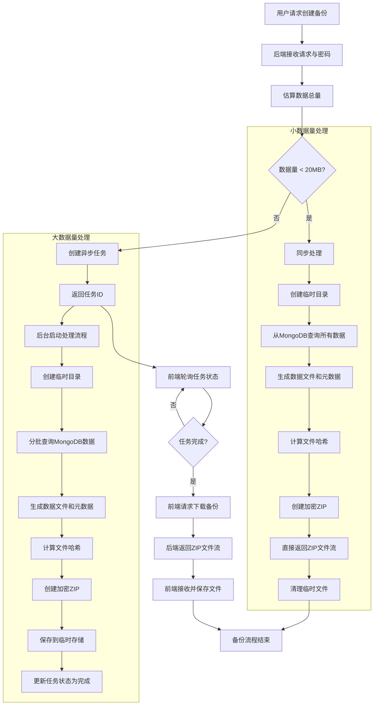

```mermaid
flowchart TD
    A[用户请求创建备份] --> B[后端接收请求与密码]
    B --> C[估算数据总量]
    
    C --> D{数据量 < 20MB?}
    
    subgraph 小数据量处理
        D -->|是| E1[同步处理]
        E1 --> F1[创建临时目录]
        F1 --> G1[从MongoDB查询所有数据]
        G1 --> H1[生成数据文件和元数据]
        H1 --> I1[计算文件哈希]
        I1 --> J1[创建加密ZIP]
        J1 --> K1[直接返回ZIP文件流]
        K1 --> L1[清理临时文件]
    end
    
    subgraph 大数据量处理
        D -->|否| E2[创建异步任务]
        E2 --> F2[返回任务ID]
        F2 --> G2[后台启动处理流程]
        
        G2 --> H2[创建临时目录]
        H2 --> I2[分批查询MongoDB数据]
        I2 --> J2[生成数据文件和元数据]
        J2 --> K2[计算文件哈希]
        K2 --> L2[创建加密ZIP]
        L2 --> M2[保存到临时存储]
        M2 --> N2[更新任务状态为完成]
    end
    
    F2 --> O[前端轮询任务状态]
    O --> P{任务完成?}
    P -->|否| O
    
    P -->|是| Q[前端请求下载备份]
    Q --> R[后端返回ZIP文件流]
    R --> S[前端接收并保存文件]
    
    L1 --> T[备份流程结束]
    S --> T
```