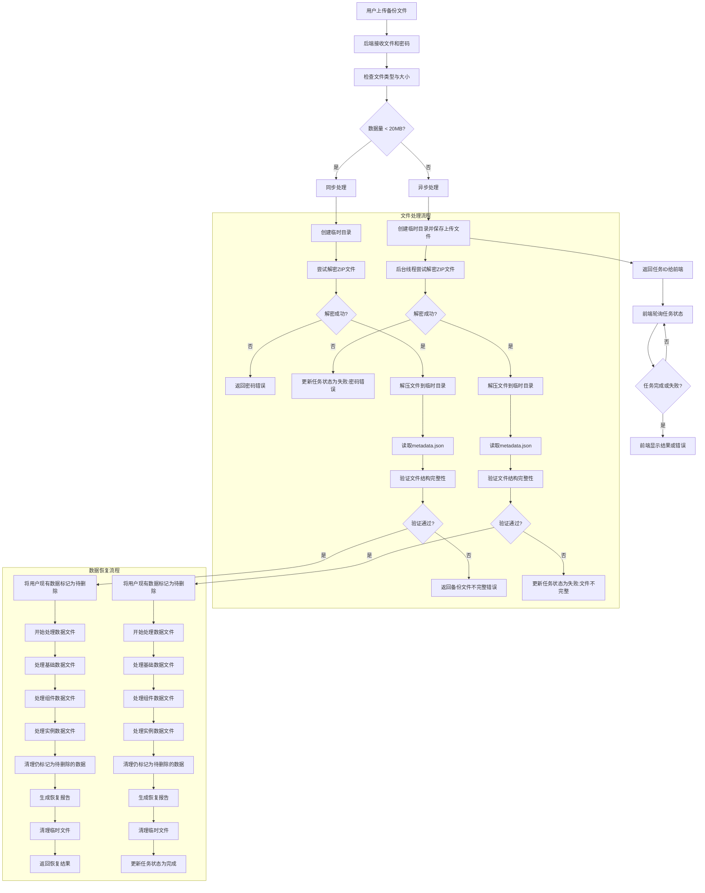

```mermaid
flowchart TD
    A[用户上传备份文件] --> B[后端接收文件和密码]
    B --> C[检查文件类型与大小]
    
    C --> D{数据量 < 20MB?}
    
    D -->|是| E1[同步处理]
    D -->|否| E2[异步处理]
    
    E1 --> F1[创建临时目录]
    E2 --> F2[创建临时目录并保存上传文件]
    F2 --> G2[返回任务ID给前端]
    
    subgraph 文件处理流程
        F1 --> H1[尝试解密ZIP文件]
        F2 --> H2[后台线程尝试解密ZIP文件]
        
        H1 --> I1{解密成功?}
        H2 --> I2{解密成功?}
        
        I1 -->|否| J1[返回密码错误]
        I2 -->|否| J2[更新任务状态为失败:密码错误]
        
        I1 -->|是| K1[解压文件到临时目录]
        I2 -->|是| K2[解压文件到临时目录]
        
        K1 --> L1[读取metadata.json]
        K2 --> L2[读取metadata.json]
        
        L1 --> M1[验证文件结构完整性]
        L2 --> M2[验证文件结构完整性]
        
        M1 --> N1{验证通过?}
        M2 --> N2{验证通过?}
        
        N1 -->|否| O1[返回备份文件不完整错误]
        N2 -->|否| O2[更新任务状态为失败:文件不完整]
    end
    
    subgraph 数据恢复流程
        N1 -->|是| P1[将用户现有数据标记为待删除]
        N2 -->|是| P2[将用户现有数据标记为待删除]
        
        P1 --> Q1[开始处理数据文件]
        P2 --> Q2[开始处理数据文件]
        
        Q1 --> R1[处理基础数据文件]
        Q2 --> R2[处理基础数据文件]
        
        R1 --> S1[处理组件数据文件]
        R2 --> S2[处理组件数据文件]
        
        S1 --> T1[处理实例数据文件]
        S2 --> T2[处理实例数据文件]
        
        T1 --> U1[清理仍标记为待删除的数据]
        T2 --> U2[清理仍标记为待删除的数据]
        
        U1 --> V1[生成恢复报告]
        U2 --> V2[生成恢复报告]
        
        V1 --> W1[清理临时文件]
        V2 --> W2[清理临时文件]
        
        W1 --> X1[返回恢复结果]
        W2 --> X2[更新任务状态为完成]
    end
    
    G2 --> Y[前端轮询任务状态]
    Y --> Z{任务完成或失败?}
    Z -->|否| Y
    Z -->|是| AA[前端显示结果或错误]
```