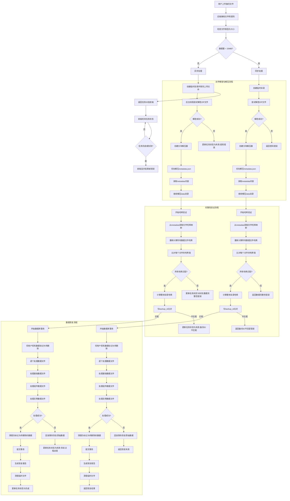

```mermaid
flowchart TD
    A[用户上传备份文件] --> B[后端接收文件和密码]
    B --> C[检查文件类型与大小]
    
    C --> D{数据量 < 20MB?}
    
    D -->|是| E1[同步处理]
    D -->|否| E2[异步处理]
    
    E1 --> F1[创建临时目录]
    E2 --> F2[创建临时目录并保存上传文件]
    F2 --> G2[返回任务ID给前端]
    
    subgraph 文件解密与解压流程
        F1 --> H1[尝试解密ZIP文件]
        F2 --> H2[后台线程尝试解密ZIP文件]
        
        H1 --> I1{解密成功?}
        H2 --> I2{解密成功?}
        
        I1 -->|否| J1[返回密码错误]
        I2 -->|否| J2[更新任务状态为失败:密码错误]
        
        I1 -->|是| K1[创建分块解压器]
        I2 -->|是| K2[创建分块解压器]
        
        K1 --> L1[优先解压metadata.json]
        K2 --> L2[优先解压metadata.json]
        
        L1 --> M1[读取metadata内容]
        L2 --> M2[读取metadata内容]
        
        M1 --> N1[继续解压data目录]
        M2 --> N2[继续解压data目录]
    end
    
    subgraph 完整性验证流程
        N1 --> O1[开始哈希验证]
        N2 --> O2[开始哈希验证]
        
        O1 --> P1[从metadata获取文件哈希映射]
        O2 --> P2[从metadata获取文件哈希映射]
        
        P1 --> Q1[重新计算所有数据文件哈希]
        P2 --> Q2[重新计算所有数据文件哈希]
        
        Q1 --> R1[比对每个文件的哈希值]
        Q2 --> R2[比对每个文件的哈希值]
        
        R1 --> S1{所有哈希匹配?}
        R2 --> S2{所有哈希匹配?}
        
        S1 -->|否| T1[返回数据完整性错误]
        S2 -->|否| T2[更新任务状态为失败:数据完整性错误]
        
        S1 -->|是| U1[计算整体目录哈希]
        S2 -->|是| U2[计算整体目录哈希]
        
        U1 --> V1[与backup_id比对]
        U2 --> V2[与backup_id比对]
        
        V1 -->|不匹配| W1[返回备份ID不匹配错误]
        V2 -->|不匹配| W2[更新任务状态为失败:备份ID不匹配]
    end
    
    subgraph 数据恢复流程
        V1 -->|匹配| X1[开始数据库事务]
        V2 -->|匹配| X2[开始数据库事务]
        
        X1 --> Y1[将用户现有数据标记为待删除]
        X2 --> Y2[将用户现有数据标记为待删除]
        
        Y1 --> Z1[逐个处理数据文件]
        Y2 --> Z2[逐个处理数据文件]
        
        Z1 --> AA1[处理基础数据文件]
        Z2 --> AA2[处理基础数据文件]
        
        AA1 --> AB1[处理组件数据文件]
        AA2 --> AB2[处理组件数据文件]
        
        AB1 --> AC1[处理实例数据文件]
        AB2 --> AC2[处理实例数据文件]
        
        AC1 --> AD1{处理成功?}
        AC2 --> AD2{处理成功?}
        
        AD1 -->|否| AE1[回滚事务恢复原始数据]
        AD2 -->|否| AE2[回滚事务恢复原始数据]
        
        AD1 -->|是| AF1[清理仍标记为待删除的数据]
        AD2 -->|是| AF2[清理仍标记为待删除的数据]
        
        AF1 --> AG1[提交事务]
        AF2 --> AG2[提交事务]
        
        AG1 --> AH1[生成恢复报告]
        AG2 --> AH2[生成恢复报告]
        
        AH1 --> AI1[清理临时文件]
        AH2 --> AI2[清理临时文件]
        
        AI1 --> AJ1[返回恢复结果]
        AI2 --> AJ2[更新任务状态为完成]
        
        AE1 --> AK1[返回恢复失败]
        AE2 --> AK2[更新任务状态为失败:恢复过程出错]
    end
    
    G2 --> AL[前端轮询任务状态]
    AL --> AM{任务完成或失败?}
    AM -->|否| AL
    AM -->|是| AN[前端显示结果或错误]
```