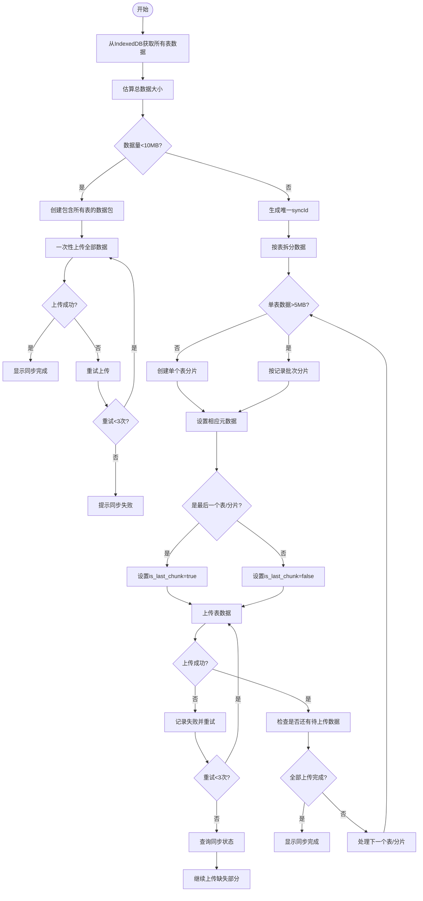

```mermaid

flowchart TD
    A([开始]) -->E[从IndexedDB获取所有表数据]
    E --> F[估算总数据大小]
    F --> G{数据量<10MB?}
    
    %% 小数据量处理流程
    G -->|是| H[创建包含所有表的数据包]
    H --> J[一次性上传全部数据]
    J --> K{上传成功?}
    K -->|是| L[显示同步完成]
    K -->|否| M[重试上传]
    M --> N{重试<3次?}
    N -->|是| J
    N -->|否| O[提示同步失败]
    
    %% 中大数据量处理流程
    G -->|否| P[生成唯一syncId]
    P --> Q[按表拆分数据]
    Q --> R{单表数据>5MB?}
    R -->|否| S[创建单个表分片]
    R -->|是| T[按记录批次分片]
    S --> U[设置相应元数据]
    T --> U
    U --> V{是最后一个表/分片?}
    V -->|是| W[设置is_last_chunk=true]
    V -->|否| X[设置is_last_chunk=false]
    W --> Y[上传表数据]
    X --> Y
    Y --> Z{上传成功?}
    Z -->|是| AA[检查是否还有待上传数据]
    Z -->|否| AB[记录失败并重试]
    AB --> AC{重试<3次?}
    AC -->|是| Y
    AC -->|否| AD[查询同步状态]
    AD --> AE[继续上传缺失部分]
    AA --> AF{全部上传完成?}
    AF -->|是| AG[显示同步完成]
    AF -->|否| AH[处理下一个表/分片]
    AH --> R

```