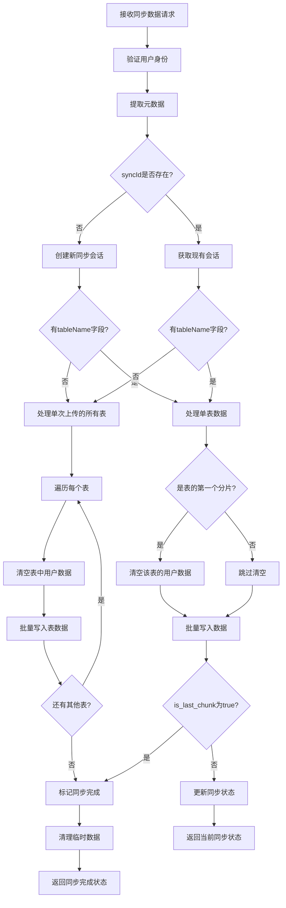

```mermaid

flowchart TD
    A[接收同步数据请求] --> B[验证用户身份]
    B --> C[提取元数据]
    C --> D{syncId是否存在?}
    
    %% 新同步会话
    D -->|否| E[创建新同步会话]
    E --> F{有tableName字段?}
    
    %% 小数据量处理
    F -->|否| G[处理单次上传的所有表]
    G --> H[遍历每个表]
    H --> I[清空表中用户数据]
    I --> J[批量写入表数据]
    J --> K{还有其他表?}
    K -->|是| H
    K -->|否| L[标记同步完成]
    
    %% 分表上传处理
    F -->|是| M[处理单表数据]
    M --> N{是表的第一个分片?}
    N -->|是| O[清空该表的用户数据]
    N -->|否| P[跳过清空]
    O --> Q[批量写入数据]
    P --> Q
    
    %% 现有同步会话
    D -->|是| R[获取现有会话]
    R --> S{有tableName字段?}
    S -->|是| M
    S -->|否| G
    
    %% 后续处理
    Q --> T{is_last_chunk为true?}
    T -->|是| L
    T -->|否| U[更新同步状态]
    L --> V[清理临时数据]
    V --> W[返回同步完成状态]
    U --> X[返回当前同步状态]

```