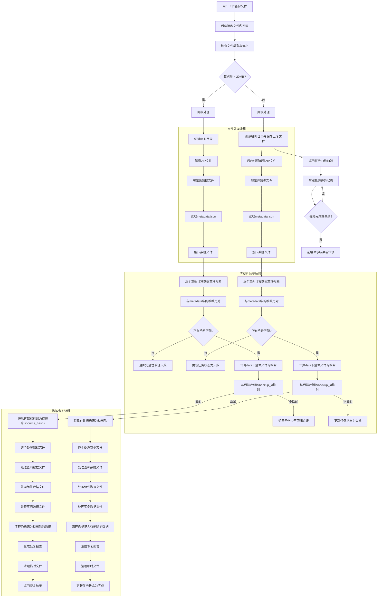

```mermaid

flowchart TD
    A[用户上传备份文件] --> B[后端接收文件和密码]
    B --> C[检查文件类型与大小]
    
    C --> D{数据量 < 20MB?}
    
    D -->|是| E1[同步处理]
    D -->|否| E2[异步处理]
    
    E1 --> F1[创建临时目录]
    E2 --> F2[创建临时目录并保存上传文件]
    F2 --> G2[返回任务ID给前端]
    
    subgraph 文件处理流程
        F1 --> H1[解密ZIP文件]
        F2 --> H2[后台线程解密ZIP文件]
        
        H1 --> I1[解压元数据文件]
        H2 --> I2[解压元数据文件]
        
        I1 --> J1[读取metadata.json]
        I2 --> J2[读取metadata.json]
        
        J1 --> K1[解压数据文件]
        J2 --> K2[解压数据文件]
    end
    
    subgraph 完整性验证流程
        K1 --> L1[逐个重新计算数据文件哈希]
        K2 --> L2[逐个重新计算数据文件哈希]
        
        L1 --> M1[与metadata中的哈希比对]
        L2 --> M2[与metadata中的哈希比对]
        
        M1 --> N1{所有哈希匹配?}
        M2 --> N2{所有哈希匹配?}
        
        N1 -->|否| O1[返回完整性验证失败]
        N2 -->|否| O2[更新任务状态为失败]
        
        N1 -->|是| P1[计算data下整体文件的哈希]
        N2 -->|是| P2[计算data下整体文件的哈希]
        
        P1 --> Q1[与后端存储的backup_id比对]
        P2 --> Q2[与后端存储的backup_id比对]
        
        Q1 -->|不匹配| R1[返回备份ID不匹配错误]
        Q2 -->|不匹配| R2[更新任务状态为失败]
    end
    
    subgraph 数据恢复流程
        Q1 -->|匹配| S1[将现有数据标记为待删除,soource_hash=]
        Q2 -->|匹配| S2[将现有数据标记为待删除]
        
        S1 --> T1[逐个处理数据文件]
        S2 --> T2[逐个处理数据文件]
        
        T1 --> U1[处理基础数据文件]
        T2 --> U2[处理基础数据文件]
        
        U1 --> V1[处理组件数据文件]
        U2 --> V2[处理组件数据文件]
        
        V1 --> W1[处理实例数据文件]
        V2 --> W2[处理实例数据文件]
        
        W1 --> X1[清理仍标记为待删除的数据]
        W2 --> X2[清理仍标记为待删除的数据]
        
        X1 --> Y1[生成恢复报告]
        X2 --> Y2[生成恢复报告]
        
        Y1 --> Z1[清理临时文件]
        Y2 --> Z2[清理临时文件]
        
        Z1 --> AA1[返回恢复结果]
        Z2 --> AA2[更新任务状态为完成]
    end
    
    G2 --> AB[前端轮询任务状态]
    AB --> AC{任务完成或失败?}
    AC -->|否| AB
    AC -->|是| AD[前端显示结果或错误]

```