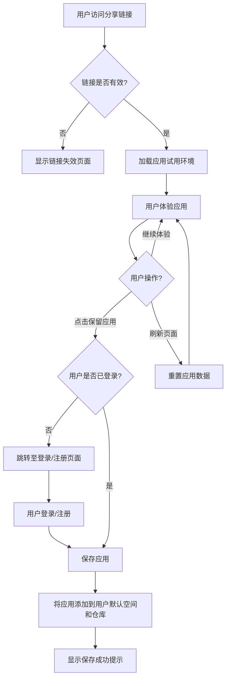

```mermaid
flowchart TD
    A[用户访问分享链接] --> B{链接是否有效?}
    B -->|否| C[显示链接失效页面]
    B -->|是| D[加载应用试用环境]
    D --> E[用户体验应用]
    E --> F{用户操作?}
    F -->|继续体验| E
    F -->|点击保留应用| G{用户是否已登录?}
    G -->|否| H[跳转至登录/注册页面]
    H --> I[用户登录/注册]
    I --> J[保存应用]
    G -->|是| J
    J --> K[将应用添加到用户默认空间和仓库]
    K --> L[显示保存成功提示]
    F -->|刷新页面| M[重置应用数据]
    M --> E
```