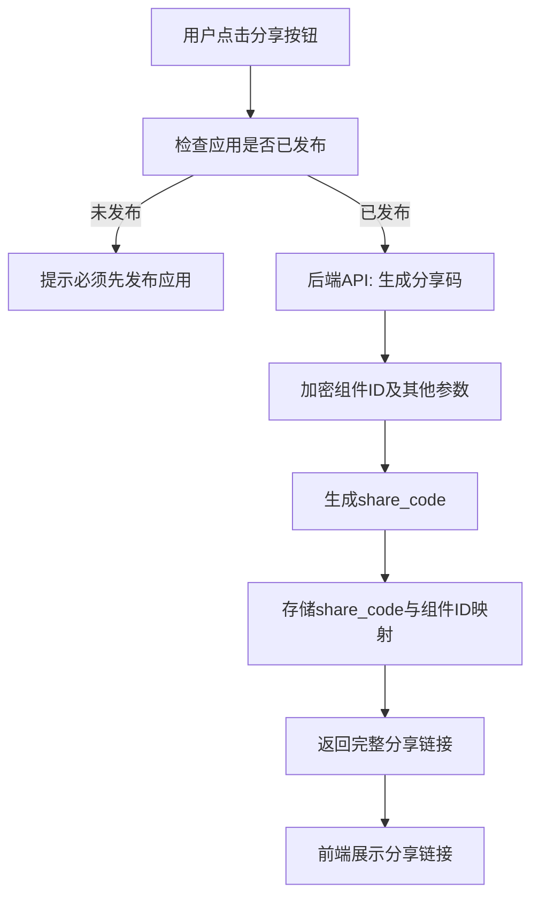

```mermaid
flowchart TD
    A[用户点击分享按钮] --> B[检查应用是否已发布]
    B -->|未发布| C[提示必须先发布应用]
    B -->|已发布| D[后端API: 生成分享码]
    D --> E[加密组件ID及其他参数]
    E --> F[生成share_code]
    F --> G[存储share_code与组件ID映射]
    G --> H[返回完整分享链接]
    H --> I[前端展示分享链接]
    
    style B decision
```