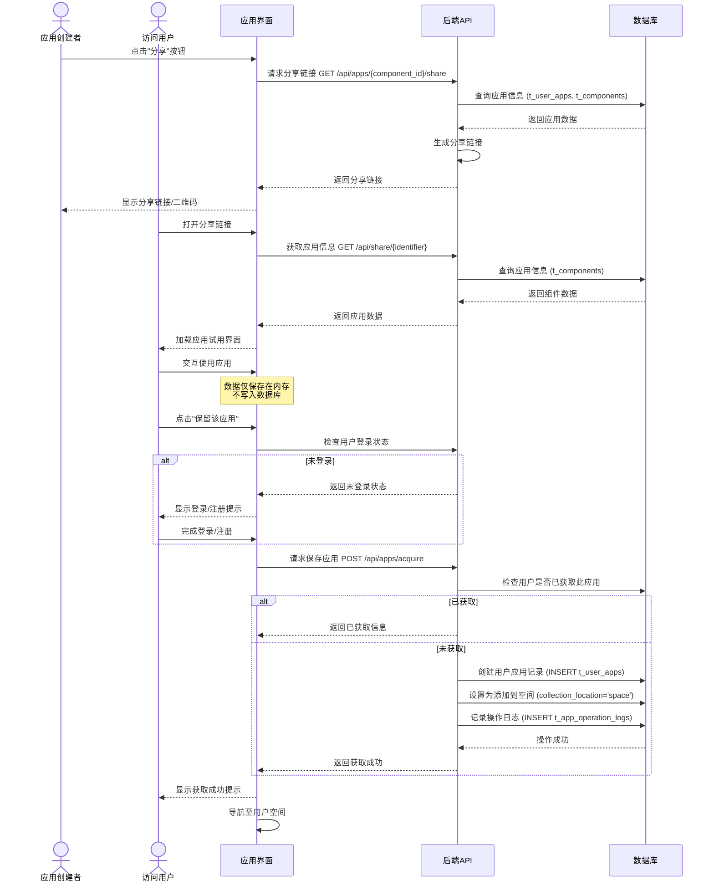

```mermaid
sequenceDiagram
    actor Creator as 应用创建者
    actor Visitor as 访问用户
    participant App as 应用界面
    participant API as 后端API
    participant DB as 数据库
    
    %% 分享流程
    Creator->>App: 点击"分享"按钮
    App->>API: 请求分享链接 GET /api/apps/{component_id}/share
    API->>DB: 查询应用信息 (t_user_apps, t_components)
    DB-->>API: 返回应用数据
    API->>API: 生成分享链接
    API-->>App: 返回分享链接
    App-->>Creator: 显示分享链接/二维码
    
    %% 访问流程
    Visitor->>App: 打开分享链接
    App->>API: 获取应用信息 GET /api/share/{identifier}
    API->>DB: 查询应用信息 (t_components)
    DB-->>API: 返回组件数据
    API-->>App: 返回应用数据
    App-->>Visitor: 加载应用试用界面
    
    %% 应用试用
    Visitor->>App: 交互使用应用
    Note over App: 数据仅保存在内存<br>不写入数据库
    
    %% 保留应用
    Visitor->>App: 点击"保留该应用"
    App->>API: 检查用户登录状态
    
    alt 未登录
        API-->>App: 返回未登录状态
        App-->>Visitor: 显示登录/注册提示
        Visitor->>App: 完成登录/注册
    end
    
    App->>API: 请求保存应用 POST /api/apps/acquire
    API->>DB: 检查用户是否已获取此应用
    
    alt 已获取
        API-->>App: 返回已获取信息
    else 未获取
        API->>DB: 创建用户应用记录 (INSERT t_user_apps)
        API->>DB: 设置为添加到空间 (collection_location='space')
        API->>DB: 记录操作日志 (INSERT t_app_operation_logs)
        DB-->>API: 操作成功
        API-->>App: 返回获取成功
    end
    
    App-->>Visitor: 显示获取成功提示
    App->>App: 导航至用户空间
```