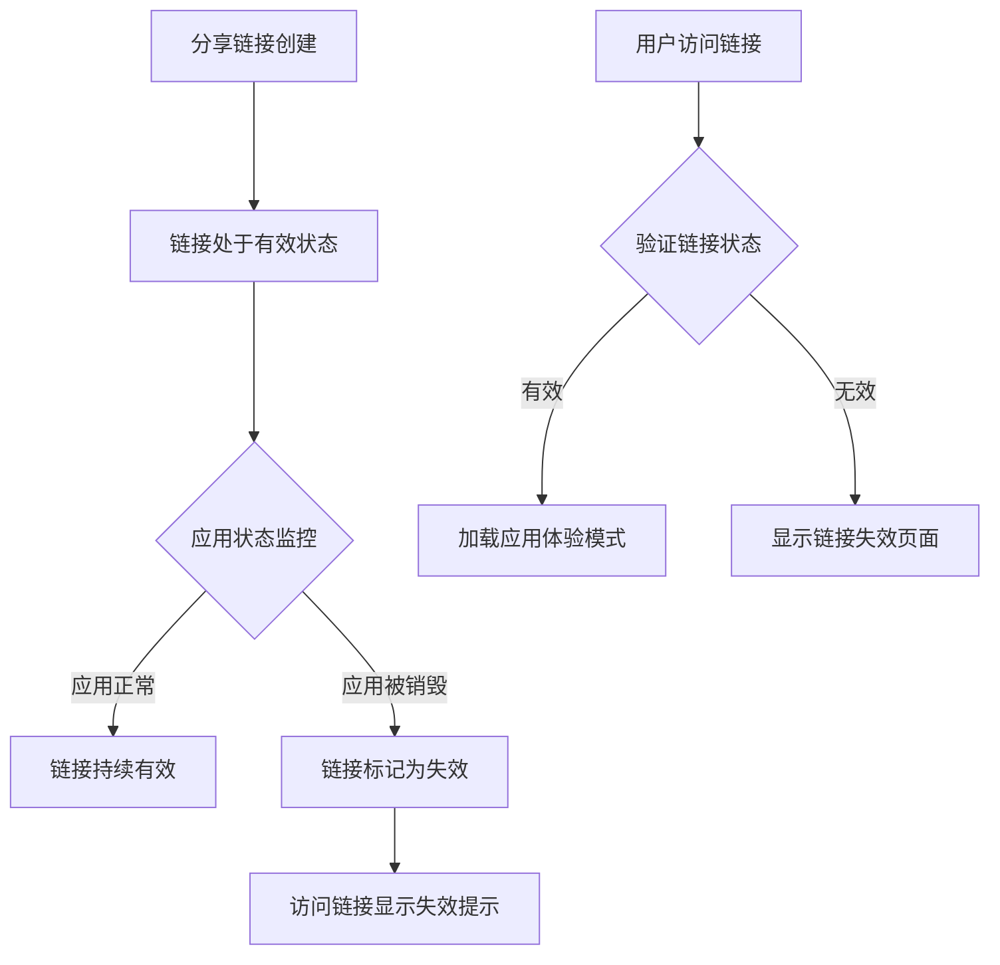

```mermaid
flowchart TD
    A[分享链接创建] --> B[链接处于有效状态]
    B --> C{应用状态监控}
    C -->|应用正常| D[链接持续有效]
    C -->|应用被销毁| E[链接标记为失效]
    E --> F[访问链接显示失效提示]
    
    G[用户访问链接] --> H{验证链接状态}
    H -->|有效| I[加载应用体验模式]
    H -->|无效| J[显示链接失效页面]
```