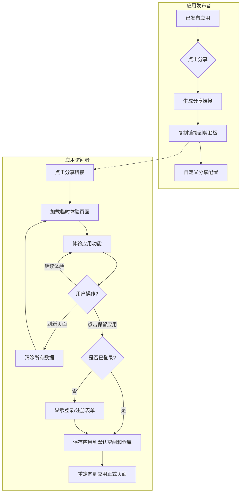

```mermaid
flowchart TD
    subgraph "应用发布者"
        A1[已发布应用] --> A2{点击分享}
        A2 --> A3[生成分享链接]
        A3 --> A4[复制链接到剪贴板]
        A4 --> A5[自定义分享配置]
    end

    subgraph "应用访问者"
        B1[点击分享链接] --> B2[加载临时体验页面]
        B2 --> B3[体验应用功能]
        B3 --> B4{用户操作?}
        
        B4 -->|继续体验| B3
        B4 -->|刷新页面| B5[清除所有数据]
        B5 --> B2
        
        B4 -->|点击保留应用| B6{是否已登录?}
        B6 -->|是| B8[保存应用到默认空间和仓库]
        B6 -->|否| B7[显示登录/注册表单]
        B7 --> B8
        B8 --> B9[重定向到应用正式页面]
    end

    A4 -.-> B1
```