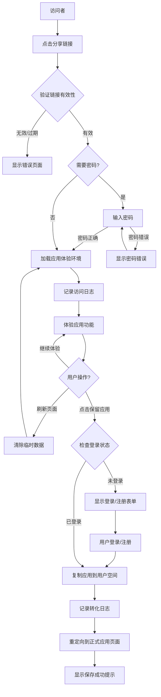

```mermaid
flowchart TD
    A[访问者] --> B[点击分享链接]
    B --> C{验证链接有效性}
    C -->|无效/过期| D[显示错误页面]
    C -->|有效| E{需要密码?}
    
    E -->|是| F[输入密码]
    F -->|密码正确| G[加载应用体验环境]
    F -->|密码错误| H[显示密码错误]
    H --> F
    
    E -->|否| G
    
    G --> I[记录访问日志]
    I --> J[体验应用功能]
    
    J --> K{用户操作?}
    K -->|继续体验| J
    K -->|刷新页面| L[清除临时数据]
    L --> G
    
    K -->|点击保留应用| M{检查登录状态}
    M -->|未登录| N[显示登录/注册表单]
    N --> O[用户登录/注册]
    O --> P[复制应用到用户空间]
    
    M -->|已登录| P
    
    P --> Q[记录转化日志]
    Q --> R[重定向到正式应用页面]
    R --> S[显示保存成功提示]
    
    style C decision
    style E decision
    style K decision
    style M decision
```