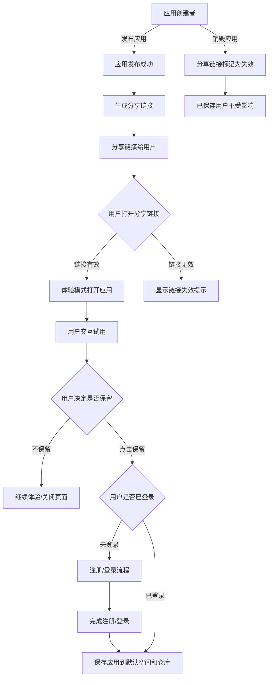

```mermaid
flowchart TD
    A[应用创建者] -->|发布应用| B[应用发布成功]
    B --> C[生成分享链接]
    C --> D[分享链接给用户]
    D --> E{用户打开分享链接}
    E -->|链接有效| F[体验模式打开应用]
    E -->|链接无效| F1[显示链接失效提示]
    F --> G[用户交互试用]
    G --> H{用户决定是否保留}
    H -->|不保留| I[继续体验/关闭页面]
    H -->|点击保留| J{用户是否已登录}
    J -->|未登录| K[注册/登录流程]
    K --> L[完成注册/登录]
    L --> M[保存应用到默认空间和仓库]
    J -->|已登录| M
    
    A -->|销毁应用| N[分享链接标记为失效]
    N --> O[已保存用户不受影响]
```