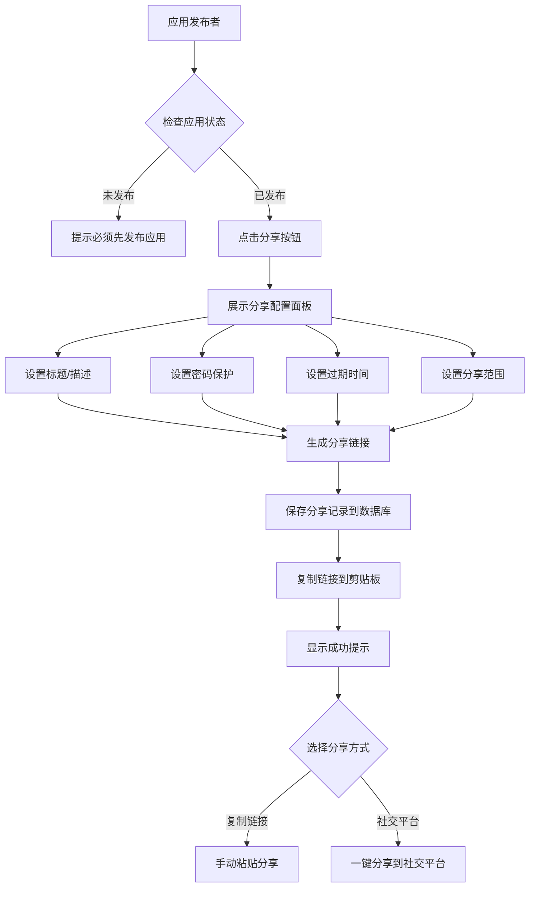

```mermaid
flowchart TD
    A[应用发布者] --> B{检查应用状态}
    B -->|未发布| C[提示必须先发布应用]
    B -->|已发布| D[点击分享按钮]
    D --> E[展示分享配置面板]
    
    E --> F[设置标题/描述]
    E --> G[设置密码保护]
    E --> H[设置过期时间]
    E --> I[设置分享范围]
    
    F & G & H & I --> J[生成分享链接]
    J --> K[保存分享记录到数据库]
    K --> L[复制链接到剪贴板]
    L --> M[显示成功提示]
    
    M --> N{选择分享方式}
    N -->|复制链接| O[手动粘贴分享]
    N -->|社交平台| P[一键分享到社交平台]
    
    style B decision
    style N decision
```