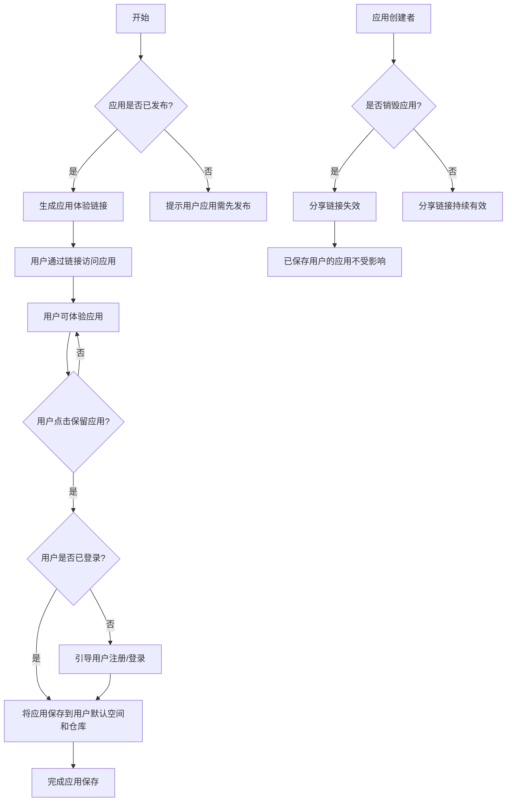

```mermaid
flowchart TD
    A[开始] --> B{应用是否已发布?}
    B -- 是 --> C[生成应用体验链接]
    B -- 否 --> D[提示用户应用需先发布]
    C --> E[用户通过链接访问应用]
    E --> F[用户可体验应用]
    F --> G{用户点击保留应用?}
    G -- 是 --> H{用户是否已登录?}
    G -- 否 --> F
    H -- 是 --> J[将应用保存到用户默认空间和仓库]
    H -- 否 --> I[引导用户注册/登录]
    I --> J
    J --> K[完成应用保存]
    
    L[应用创建者] --> M{是否销毁应用?}
    M -- 是 --> N[分享链接失效]
    M -- 否 --> O[分享链接持续有效]
    N --> P[已保存用户的应用不受影响]
```