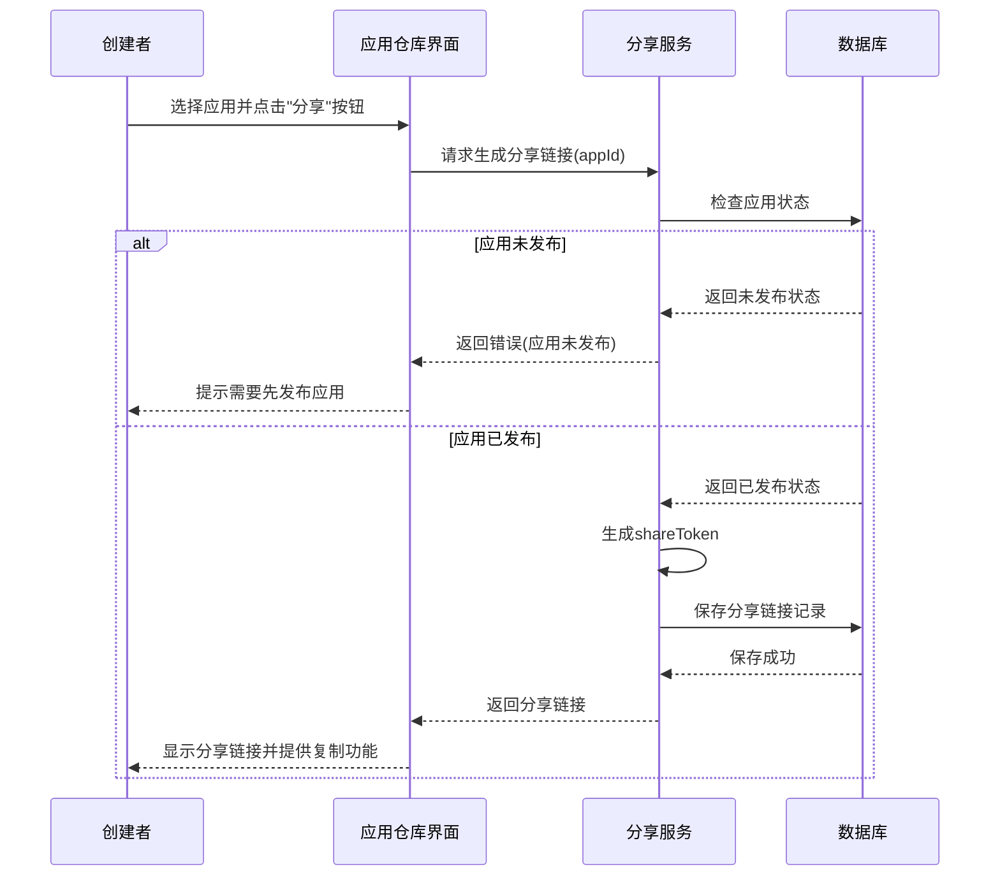

```mermaid
sequenceDiagram
    participant 创建者
    participant 应用仓库界面
    participant 分享服务
    participant 数据库
    
    创建者->>应用仓库界面: 选择应用并点击"分享"按钮
    应用仓库界面->>分享服务: 请求生成分享链接(appId)
    分享服务->>数据库: 检查应用状态
    
    alt 应用未发布
        数据库-->>分享服务: 返回未发布状态
        分享服务-->>应用仓库界面: 返回错误(应用未发布)
        应用仓库界面-->>创建者: 提示需要先发布应用
    else 应用已发布
        数据库-->>分享服务: 返回已发布状态
        分享服务->>分享服务: 生成shareToken
        分享服务->>数据库: 保存分享链接记录
        数据库-->>分享服务: 保存成功
        分享服务-->>应用仓库界面: 返回分享链接
        应用仓库界面-->>创建者: 显示分享链接并提供复制功能
    end
```