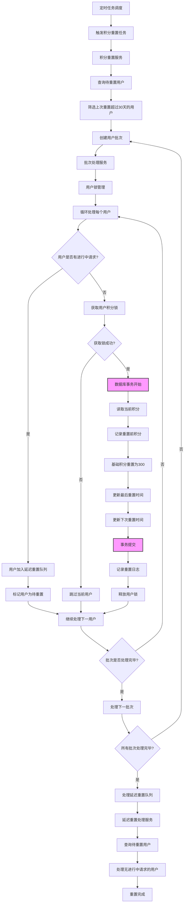

```mermaid
flowchart TD
    A[定时任务调度] --> B[触发积分重置任务]
    B --> C[积分重置服务]
    
    C --> D[查询待重置用户]
    D --> E[筛选上次重置超过30天的用户]
    E --> F[创建用户批次]
    
    F --> G[批次处理服务]
    G --> H[用户锁管理]
    H --> I[循环处理每个用户]
    
    I --> J{用户是否有进行中请求?}
    J -->|是| K[用户加入延迟重置队列]
    K --> L[标记用户为待重置]
    L --> M[继续处理下一用户]
    
    J -->|否| N[获取用户积分锁]
    N --> O{获取锁成功?}
    O -->|否| P[跳过当前用户]
    P --> M
    
    O -->|是| Q[数据库事务开始]
    Q --> R[读取当前积分]
    R --> S[记录重置前积分]
    S --> T[基础积分重置为300]
    T --> U[更新最后重置时间]
    U --> V[更新下次重置时间]
    V --> W[事务提交]
    
    W --> X[记录重置日志]
    X --> Y[释放用户锁]
    Y --> M
    
    M --> Z{批次是否处理完毕?}
    Z -->|否| I
    Z -->|是| AA[处理下一批次]
    
    AA --> AB{所有批次处理完毕?}
    AB -->|否| F
    AB -->|是| AC[处理延迟重置队列]
    
    AC --> AD[延迟重置处理服务]
    AD --> AE[查询待重置用户]
    AE --> AF[处理无进行中请求的用户]
    AF --> AG[重置完成]
    
    style Q fill:#f9f,stroke:#333,stroke-width:2px
    style W fill:#f9f,stroke:#333,stroke-width:2px
```