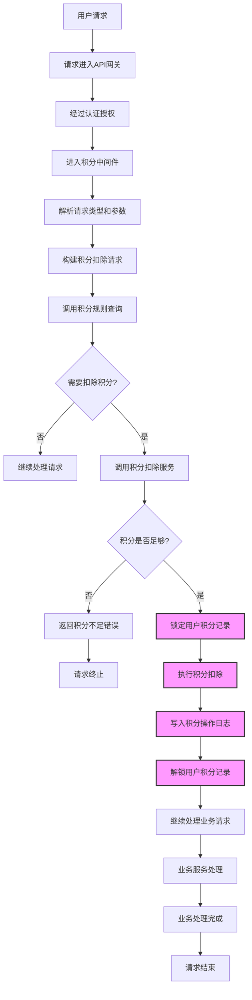

```mermaid
flowchart TD
    A[用户请求] --> B[请求进入API网关]
    B --> C[经过认证授权]
    C --> D[进入积分中间件]
    
    D --> E[解析请求类型和参数]
    E --> F[构建积分扣除请求]
    F --> G[调用积分规则查询]
    
    G --> H{需要扣除积分?}
    H -->|否| I[继续处理请求]
    
    H -->|是| J[调用积分扣除服务]
    J --> K{积分是否足够?}
    
    K -->|否| L[返回积分不足错误]
    L --> M[请求终止]
    
    K -->|是| N[锁定用户积分记录]
    N --> O[执行积分扣除]
    O --> P[写入积分操作日志]
    P --> Q[解锁用户积分记录]
    
    Q --> R[继续处理业务请求]
    R --> S[业务服务处理]
    S --> T[业务处理完成]
    T --> U[请求结束]
    
    style N fill:#f9f,stroke:#333,stroke-width:2px
    style O fill:#f9f,stroke:#333,stroke-width:2px
    style P fill:#f9f,stroke:#333,stroke-width:2px
    style Q fill:#f9f,stroke:#333,stroke-width:2px
```