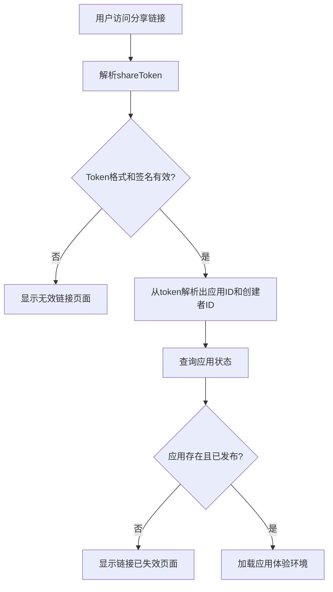

```mermaid
flowchart TD
   
    G[用户访问分享链接] --> H[解析shareToken]
    H --> I{Token格式和签名有效?}
    I -->|否| J[显示无效链接页面]
    I -->|是| K[从token解析出应用ID和创建者ID]
    K --> L[查询应用状态]
    L --> M{应用存在且已发布?}
    M -->|否| N[显示链接已失效页面]
    M -->|是| O[加载应用体验环境]
```