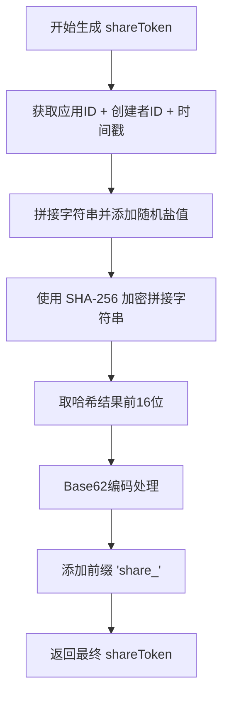

```mermaid
flowchart TD
    A[开始生成 shareToken] --> B[获取应用ID + 创建者ID + 时间戳]
    B --> C[拼接字符串并添加随机盐值]
    C --> D[使用 SHA-256 加密拼接字符串]
    D --> E[取哈希结果前16位]
    E --> F[Base62编码处理]
    F --> G[添加前缀 'share_']
    G --> H[返回最终 shareToken]
```