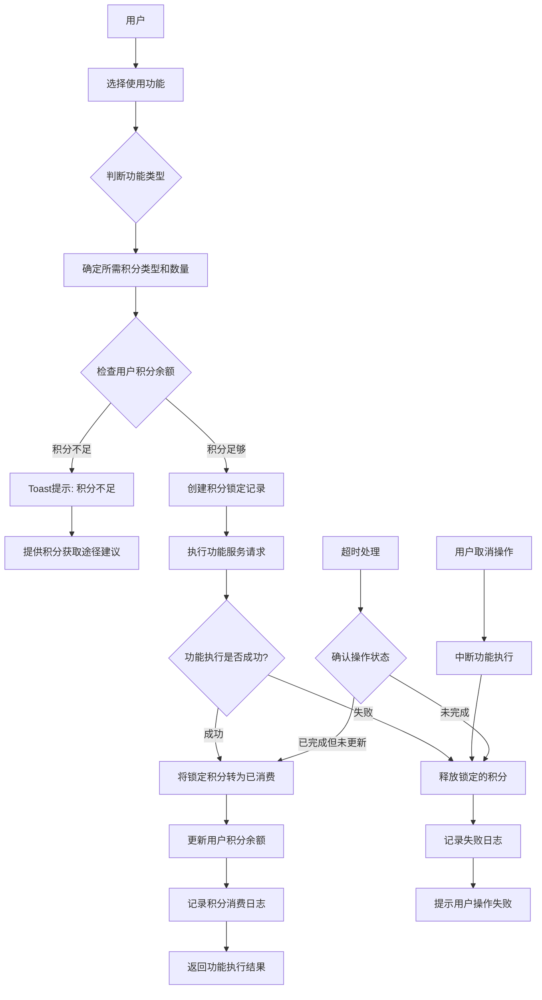

```mermaid
flowchart TD
    A[用户] --> B[选择使用功能]
    B --> C{判断功能类型}
    C --> D[确定所需积分类型和数量]
    D --> E{检查用户积分余额}
    
    E -->|积分不足| F[Toast提示: 积分不足]
    F --> G[提供积分获取途径建议]
    
    E -->|积分足够| H[创建积分锁定记录]
    H --> I[执行功能服务请求]
    
    I --> J{功能执行是否成功?}
    J -->|成功| K[将锁定积分转为已消费]
    K --> L[更新用户积分余额]
    L --> M[记录积分消费日志]
    M --> N[返回功能执行结果]
    
    J -->|失败| O[释放锁定的积分]
    O --> P[记录失败日志]
    P --> Q[提示用户操作失败]
    
    R[用户取消操作] --> S[中断功能执行]
    S --> O
    
    T[超时处理] --> U{确认操作状态}
    U -->|已完成但未更新| K
    U -->|未完成| O
```