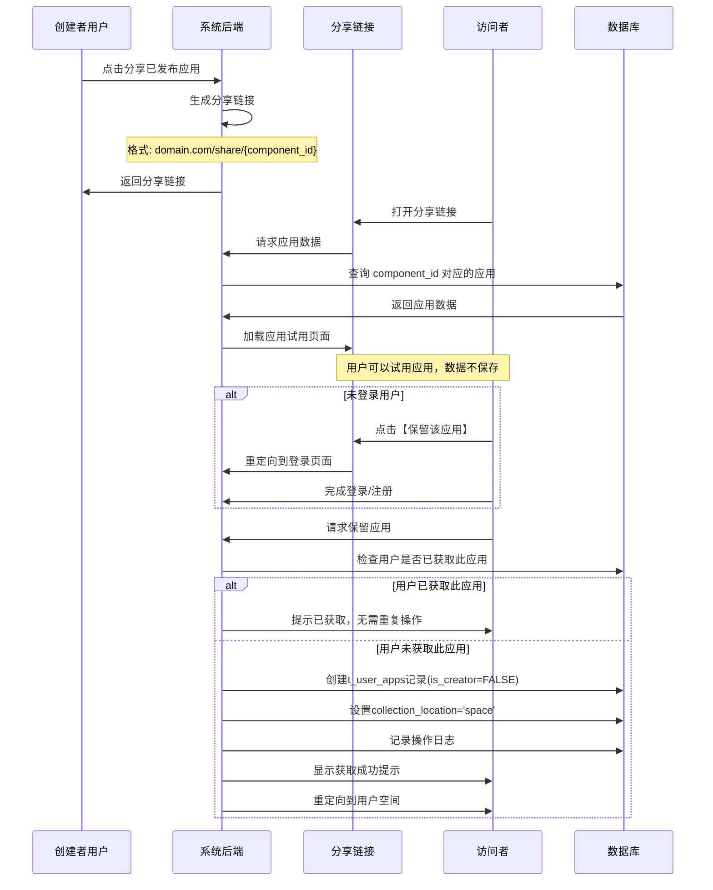

```mermaid
sequenceDiagram
    participant Creator as 创建者用户
    participant System as 系统后端
    participant ShareLink as 分享链接
    participant Visitor as 访问者
    participant DB as 数据库

    %% 创建者分享应用
    Creator->>System: 点击分享已发布应用
    System->>System: 生成分享链接
    Note over System: 格式: domain.com/share/{component_id}
    System->>Creator: 返回分享链接
    
    %% 访客访问链接
    Visitor->>ShareLink: 打开分享链接
    ShareLink->>System: 请求应用数据
    System->>DB: 查询 component_id 对应的应用
    DB->>System: 返回应用数据
    System->>ShareLink: 加载应用试用页面
    
    %% 访客试用应用
    Note over Visitor, ShareLink: 用户可以试用应用，数据不保存
    
    %% 保留应用流程
    alt 未登录用户
        Visitor->>ShareLink: 点击【保留该应用】
        ShareLink->>System: 重定向到登录页面
        Visitor->>System: 完成登录/注册
    end
    
    Visitor->>System: 请求保留应用
    System->>DB: 检查用户是否已获取此应用
    
    alt 用户已获取此应用
        System->>Visitor: 提示已获取，无需重复操作
    else 用户未获取此应用
        System->>DB: 创建t_user_apps记录(is_creator=FALSE)
        System->>DB: 设置collection_location='space'
        System->>DB: 记录操作日志
        System->>Visitor: 显示获取成功提示
        System->>Visitor: 重定向到用户空间
    end
```