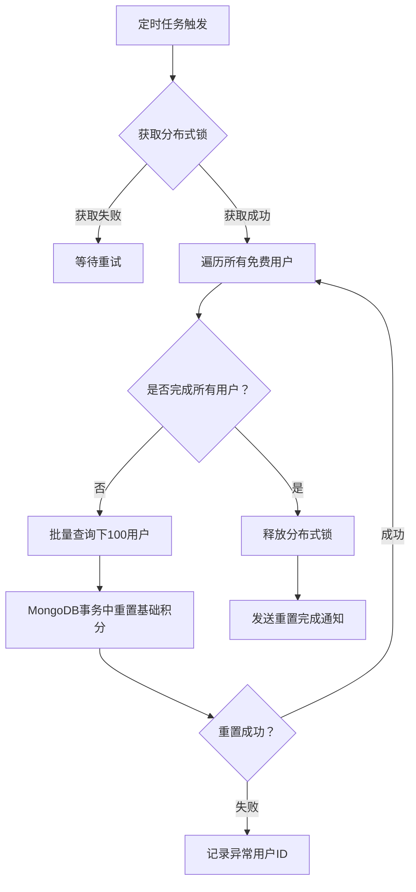

```mermaid
flowchart TD
    A[定时任务触发] --> B{获取分布式锁}
    B -->|获取失败| C[等待重试]
    B -->|获取成功| D[遍历所有免费用户]
    D --> E{是否完成所有用户？}
    E -->|否| F[批量查询下100用户]
    F --> G[MongoDB事务中重置基础积分]
    G --> H{重置成功？}
    H -->|失败| I[记录异常用户ID]
    H -->|成功| D
    E -->|是| J[释放分布式锁]
    J --> K[发送重置完成通知]
```