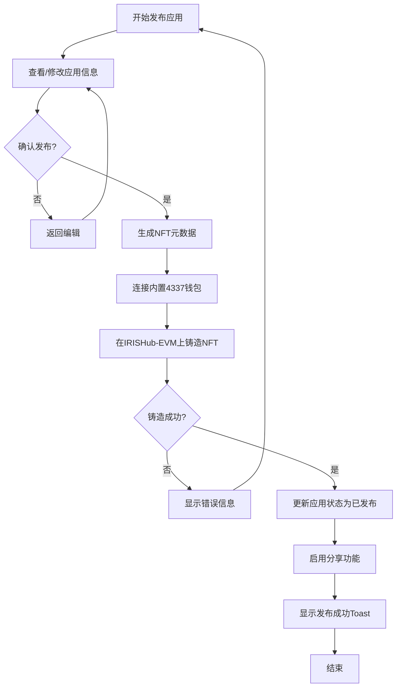

```mermaid
flowchart TD
    A[开始发布应用] --> B[查看/修改应用信息]
    B --> C{确认发布?}
    C -->|否| D[返回编辑]
    D --> B
    C -->|是| E[生成NFT元数据]
    E --> F[连接内置4337钱包]
    F --> G[在IRISHub-EVM上铸造NFT]
    G --> H{铸造成功?}
    H -->|否| I[显示错误信息]
    I --> A
    H -->|是| J[更新应用状态为已发布]
    J --> K[启用分享功能]
    K --> L[显示发布成功Toast]
    L --> M[结束]
```