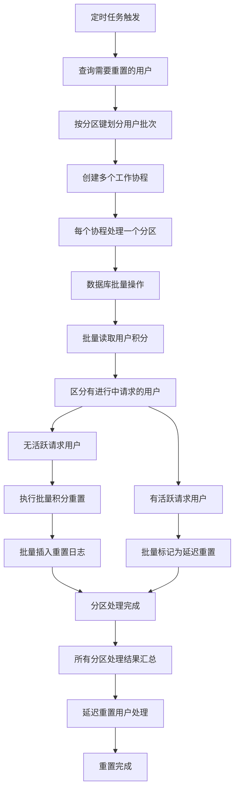

```mermaid
flowchart TD
    A[定时任务触发] --> B[查询需要重置的用户]
    B --> C[按分区键划分用户批次]
    
    C --> D[创建多个工作协程]
    D --> E[每个协程处理一个分区]
    
    E --> F[数据库批量操作]
    F --> G1[批量读取用户积分]
    G1 --> G2[区分有进行中请求的用户]
    
    G2 --> H1[无活跃请求用户]
    G2 --> H2[有活跃请求用户]
    
    H1 --> I[执行批量积分重置]
    I --> J[批量插入重置日志]
    
    H2 --> K[批量标记为延迟重置]
    
    J --> L[分区处理完成]
    K --> L
    
    L --> M[所有分区处理结果汇总]
    M --> N[延迟重置用户处理]
    N --> O[重置完成]
```