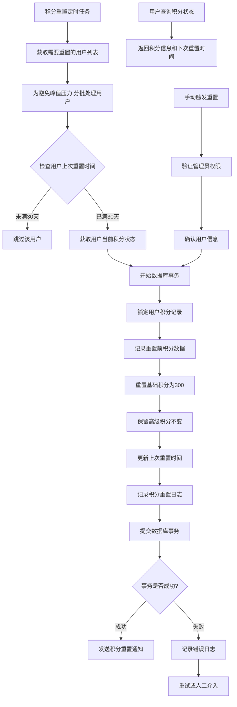

```mermaid
flowchart TD
    A[积分重置定时任务] --> B[获取需要重置的用户列表]
    B --> C[为避免峰值压力,分批处理用户]
    
    C --> D{检查用户上次重置时间}
    D -->|未满30天| E[跳过该用户]
    D -->|已满30天| F[获取用户当前积分状态]
    
    F --> G[开始数据库事务]
    G --> H[锁定用户积分记录]
    H --> I[记录重置前积分数据]
    
    I --> J[重置基础积分为300]
    J --> K[保留高级积分不变]
    K --> L[更新上次重置时间]
    
    L --> M[记录积分重置日志]
    M --> N[提交数据库事务]
    
    N --> O{事务是否成功?}
    O -->|成功| P[发送积分重置通知]
    O -->|失败| Q[记录错误日志]
    Q --> R[重试或人工介入]
    
    S[手动触发重置] --> T[验证管理员权限]
    T --> U[确认用户信息]
    U --> G
    
    V[用户查询积分状态] --> W[返回积分信息和下次重置时间]
```