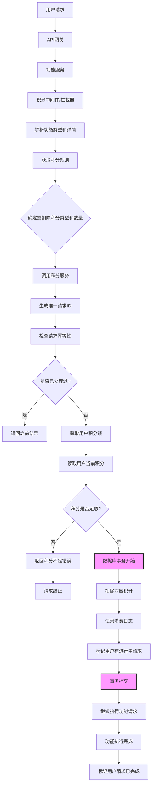

```mermaid
flowchart TD
    A[用户请求] --> B[API网关]
    B --> C[功能服务]
    C --> D[积分中间件/拦截器]
    
    D --> E[解析功能类型和详情]
    E --> F[获取积分规则]
    F --> G{确定需扣除积分类型和数量}
    
    G --> H[调用积分服务]
    H --> I[生成唯一请求ID]
    I --> J[检查请求幂等性]
    J --> K{是否已处理过?}
    
    K -->|是| L[返回之前结果]
    K -->|否| M[获取用户积分锁]
    M --> N[读取用户当前积分]
    
    N --> O{积分是否足够?}
    O -->|否| P[返回积分不足错误]
    P --> Q[请求终止]
    
    O -->|是| R[数据库事务开始]
    R --> S[扣除对应积分]
    S --> T[记录消费日志]
    T --> U[标记用户有进行中请求]
    U --> V[事务提交]
    
    V --> W[继续执行功能请求]
    W --> X[功能执行完成]
    X --> Y[标记用户请求已完成]
    
    style R fill:#f9f,stroke:#333,stroke-width:2px
    style V fill:#f9f,stroke:#333,stroke-width:2px
```