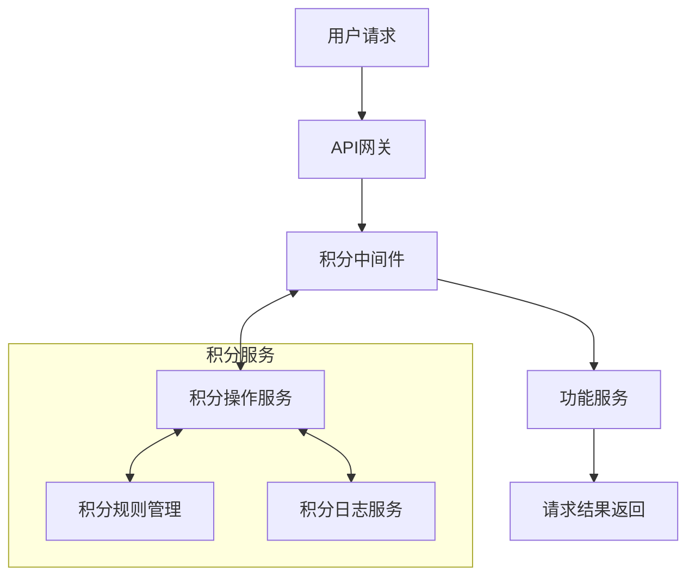

```mermaid
flowchart TD
    A[用户请求] --> B[API网关]
    B --> C[积分中间件]
    C --> D[功能服务]
    D --> E[请求结果返回]
    
    subgraph 积分服务
    F[积分规则管理]
    G[积分操作服务]
    H[积分日志服务]
    end
    
    C <--> G
    G <--> F
    G <--> H
```