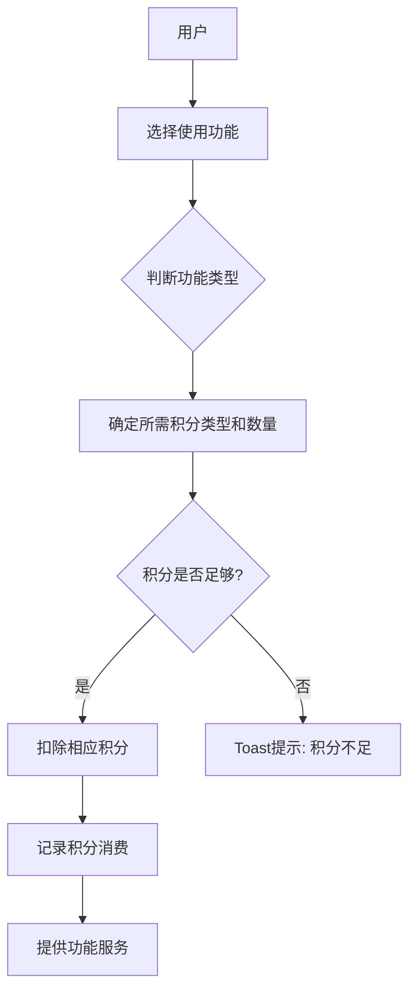

```mermaid
flowchart TD
    A[用户] --> B[选择使用功能]
    B --> C{判断功能类型}
    C --> D[确定所需积分类型和数量]
    D --> E{积分是否足够?}
    E -->|是| F[扣除相应积分]
    F --> G[记录积分消费]
    G --> H[提供功能服务]
    E -->|否| I[Toast提示: 积分不足]
```