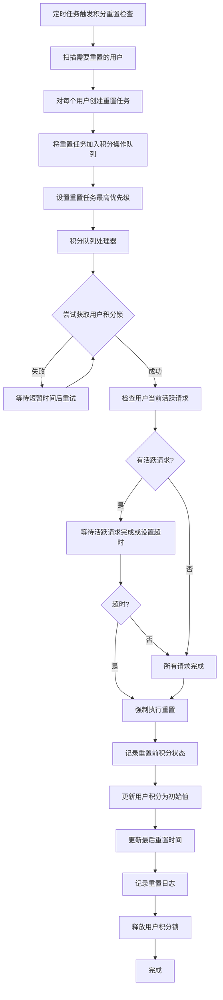

```mermaid
flowchart TD
    A[定时任务触发积分重置检查] --> B[扫描需要重置的用户]
    B --> C[对每个用户创建重置任务]
    C --> D[将重置任务加入积分操作队列]
    D --> E[设置重置任务最高优先级]
    
    E --> F[积分队列处理器]
    F --> G{尝试获取用户积分锁}
    G -->|失败| H[等待短暂时间后重试]
    H --> G
    
    G -->|成功| I[检查用户当前活跃请求]
    I --> J{有活跃请求?}
    J -->|是| K[等待活跃请求完成或设置超时]
    K --> L{超时?}
    L -->|是| M[强制执行重置]
    L -->|否| N[所有请求完成]
    
    J -->|否| N
    N --> M
    M --> O[记录重置前积分状态]
    O --> P[更新用户积分为初始值]
    P --> Q[更新最后重置时间]
    Q --> R[记录重置日志]
    R --> S[释放用户积分锁]
    S --> T[完成]
```