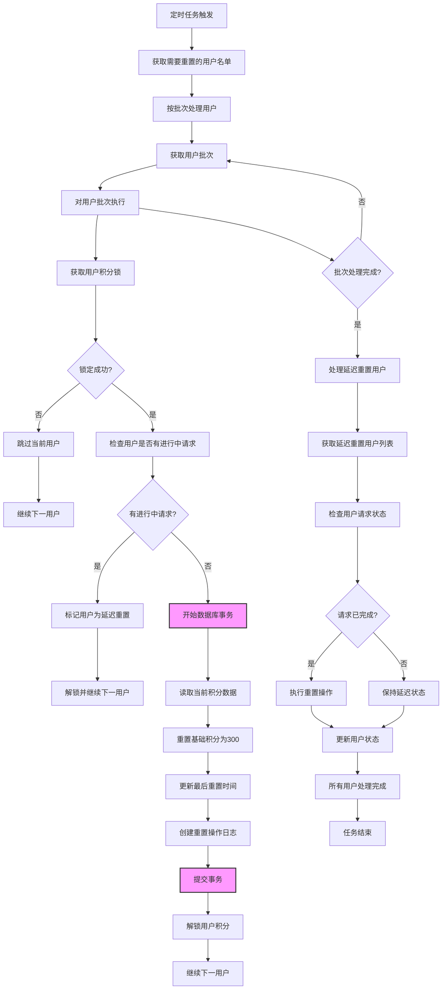

```mermaid
flowchart TD
    A[定时任务触发] --> B[获取需要重置的用户名单]
    B --> C[按批次处理用户]
    
    C --> D[获取用户批次]
    D --> E[对用户批次执行]
    
    E --> F[获取用户积分锁]
    F --> G{锁定成功?}
    
    G -->|否| H[跳过当前用户]
    H --> I[继续下一用户]
    
    G -->|是| J[检查用户是否有进行中请求]
    J --> K{有进行中请求?}
    
    K -->|是| L[标记用户为延迟重置]
    L --> M[解锁并继续下一用户]
    
    K -->|否| N[开始数据库事务]
    N --> O[读取当前积分数据]
    O --> P[重置基础积分为300]
    P --> Q[更新最后重置时间]
    Q --> R[创建重置操作日志]
    R --> S[提交事务]
    
    S --> T[解锁用户积分]
    T --> U[继续下一用户]
    
    E --> V{批次处理完成?}
    V -->|否| D
    V -->|是| W[处理延迟重置用户]
    
    W --> X[获取延迟重置用户列表]
    X --> Y[检查用户请求状态]
    Y --> Z{请求已完成?}
    Z -->|是| AA[执行重置操作]
    Z -->|否| AB[保持延迟状态]
    AA --> AC[更新用户状态]
    AB --> AC
    
    AC --> AD[所有用户处理完成]
    AD --> AE[任务结束]
    
    style N fill:#f9f,stroke:#333,stroke-width:2px
    style S fill:#f9f,stroke:#333,stroke-width:2px
```