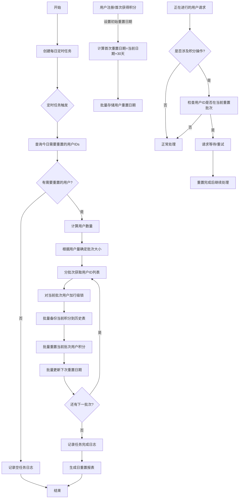

```mermaid
flowchart TD
    A[开始] --> B[创建每日定时任务]
    B --> C{定时任务触发}
    C --> D[查询今日需要重置的用户IDs]
    D --> E{有需要重置的用户?}
    E -->|否| F[记录空任务日志]
    F --> Z[结束]
    
    E -->|是| G[计算用户数量]
    G --> H[根据用户量确定批次大小]
    H --> I[分批次获取用户ID列表]
    I --> J[对当前批次用户加行级锁]
    J --> K[批量备份当前积分到历史表]
    K --> L[批量重置当前批次用户积分]
    L --> M[批量更新下次重置日期]
    M --> N{还有下一批次?}
    N -->|是| I
    N -->|否| O[记录任务完成日志]
    O --> P[生成日重置报表]
    P --> Z
    
    AA[用户注册/首次获得积分] -->|设置初始重置日期| BB[计算首次重置日期=当前日期+30天]
    BB --> CC[批量存储用户重置日期]
    
    R[正在进行的用户请求] --> S{是否涉及积分操作?}
    S -->|否| T[正常处理]
    S -->|是| U[检查用户ID是否在当前重置批次]
    U -->|否| T
    U -->|是| V[请求等待/重试]
    V --> W[重置完成后继续处理]
```