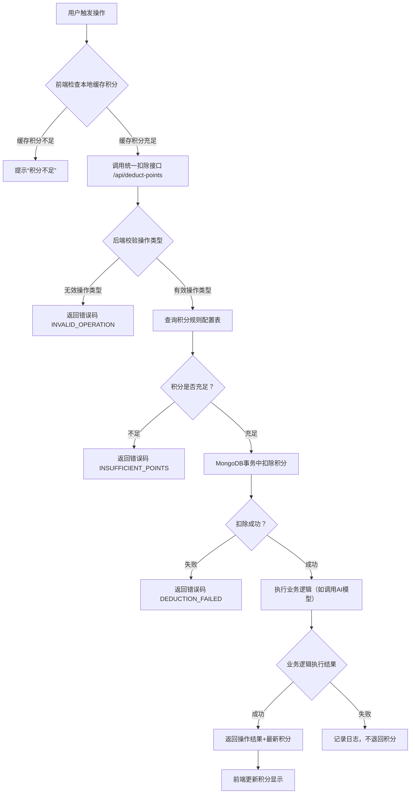

```mermaid
flowchart TD
    A[用户触发操作] --> B{前端检查本地缓存积分}
    B -->|缓存积分不足| C[提示“积分不足”]
    B -->|缓存积分充足| D[调用统一扣除接口 /api/deduct-points]
    D --> E{后端校验操作类型}
    E -->|无效操作类型| F[返回错误码 INVALID_OPERATION]
    E -->|有效操作类型| G[查询积分规则配置表]
    G --> H{积分是否充足？}
    H -->|不足| I[返回错误码 INSUFFICIENT_POINTS]
    H -->|充足| J[MongoDB事务中扣除积分]
    J --> K{扣除成功？}
    K -->|失败| L[返回错误码 DEDUCTION_FAILED]
    K -->|成功| M[执行业务逻辑（如调用AI模型）]
    M --> N{业务逻辑执行结果}
    N -->|成功| O[返回操作结果+最新积分]
    N -->|失败| P[记录日志，不退回积分]
    O --> Q[前端更新积分显示]
```