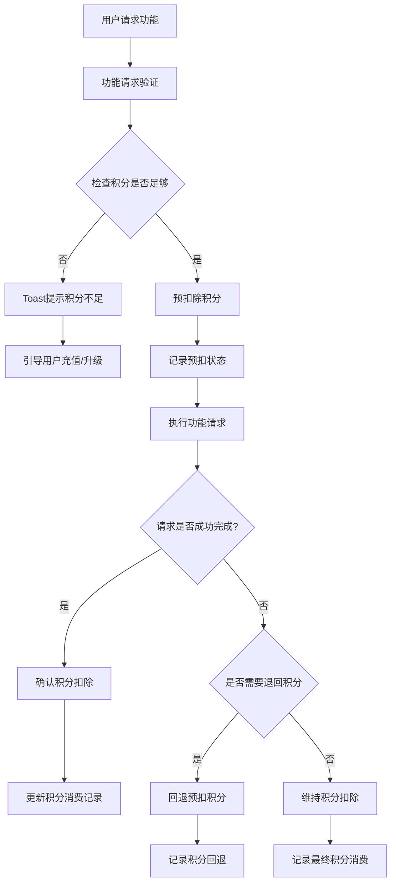

```mermaid
flowchart TD
    A[用户请求功能] --> B[功能请求验证]
    B --> C{检查积分是否足够}
    C -->|否| D[Toast提示积分不足]
    D --> E[引导用户充值/升级]
    C -->|是| F[预扣除积分]
    F --> G[记录预扣状态]
    G --> H[执行功能请求]
    H --> I{请求是否成功完成?}
    I -->|是| J[确认积分扣除]
    J --> K[更新积分消费记录]
    I -->|否| L{是否需要退回积分}
    L -->|是| M[回退预扣积分]
    L -->|否| N[维持积分扣除]
    M --> O[记录积分回退]
    N --> P[记录最终积分消费]
```