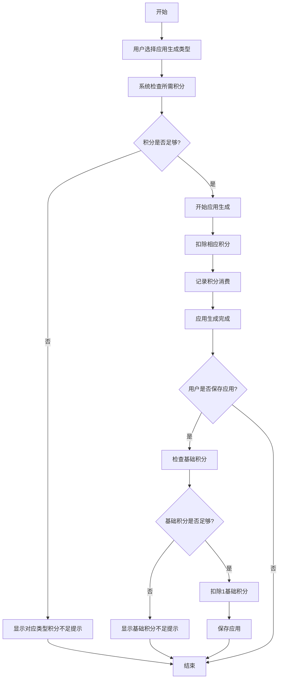

```mermaid
flowchart TD
    A[开始] --> B[用户选择应用生成类型]
    B --> C[系统检查所需积分]
    C --> D{积分是否足够?}
    D -- 否 --> E[显示对应类型积分不足提示]
    E --> F[结束]
    D -- 是 --> G[开始应用生成]
    G --> H[扣除相应积分]
    H --> I[记录积分消费]
    I --> J[应用生成完成]
    J --> K{用户是否保存应用?}
    K -- 是 --> L[检查基础积分]
    L --> M{基础积分是否足够?}
    M -- 否 --> N[显示基础积分不足提示]
    N --> F
    M -- 是 --> O[扣除1基础积分]
    O --> P[保存应用]
    P --> F
    K -- 否 --> F
```