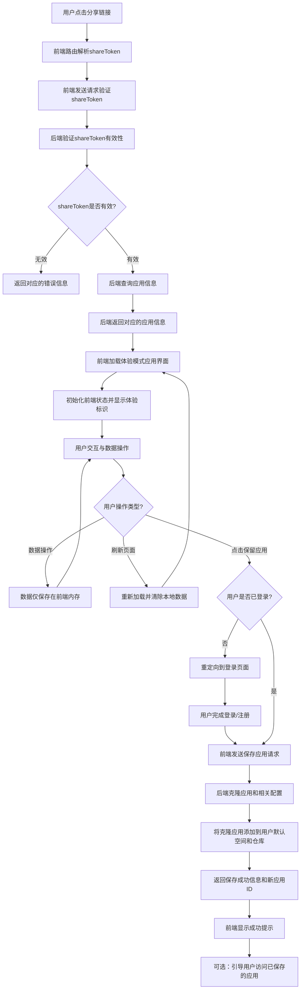

```mermaid
flowchart TD
    A[用户点击分享链接] --> B[前端路由解析shareToken]
    B --> C[前端发送请求验证shareToken]
    C --> D[后端验证shareToken有效性]
    D --> E{shareToken是否有效?}
    E -->|无效| F[返回对应的错误信息]
    E -->|有效| G[后端查询应用信息]
    G --> H[后端返回对应的应用信息]
    H --> I[前端加载体验模式应用界面]
    I --> J[初始化前端状态并显示体验标识]
    J --> K[用户交互与数据操作]
    K --> L{用户操作类型?}
    L -->|数据操作| M[数据仅保存在前端内存]
    M --> K
    L -->|刷新页面| N[重新加载并清除本地数据]
    N --> I
    L -->|点击保留应用| O{用户是否已登录?}
    O -->|否| P[重定向到登录页面]
    P --> Q[用户完成登录/注册]
    Q --> S[前端发送保存应用请求]
    O -->|是| S
    S --> T[后端克隆应用和相关配置]
    T --> U[将克隆应用添加到用户默认空间和仓库]
    U --> V[返回保存成功信息和新应用ID]
    V --> W[前端显示成功提示]
    W --> X[可选：引导用户访问已保存的应用]
```