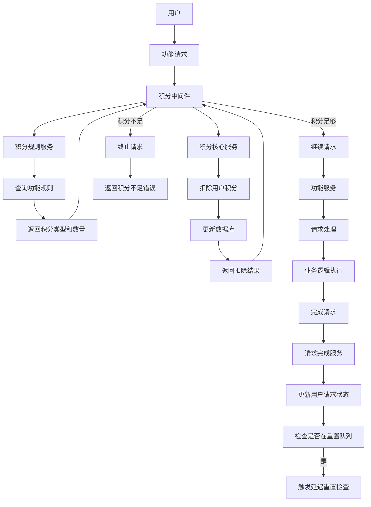

```mermaid
flowchart TD
    A[用户] --> B[功能请求]
    B --> C[积分中间件]
    
    C --> D[积分规则服务]
    D --> D1[查询功能规则]
    D1 --> D2[返回积分类型和数量]
    D2 --> C
    
    C --> E[积分核心服务]
    E --> E1[扣除用户积分]
    E1 --> E2[更新数据库]
    E2 --> E3[返回扣除结果]
    E3 --> C
    
    C -->|积分足够| F[继续请求]
    C -->|积分不足| G[终止请求]
    G --> H[返回积分不足错误]
    
    F --> I[功能服务]
    I --> J[请求处理]
    J --> K[业务逻辑执行]
    K --> L[完成请求]
    
    L --> M[请求完成服务]
    M --> N[更新用户请求状态]
    N --> O[检查是否在重置队列]
    O -->|是| P[触发延迟重置检查]
```