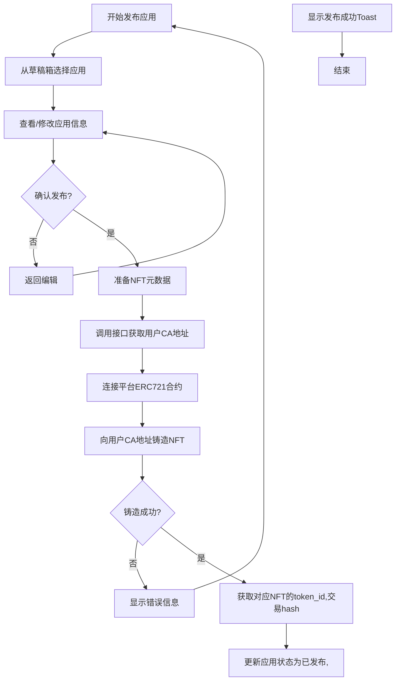

```mermaid

flowchart TD
    A[开始发布应用] --> B[从草稿箱选择应用]
    B --> C[查看/修改应用信息]
    C --> D{确认发布?}
    D -->|否| E[返回编辑]
    E --> C
    D -->|是| F[准备NFT元数据]
    F --> G[调用接口获取用户CA地址]
    G --> H[连接平台ERC721合约]
    H --> I[向用户CA地址铸造NFT]
    I --> J{铸造成功?}
    J -->|否| K[显示错误信息]
    K --> A
    J -->|是| L[获取对应NFT的token_id,交易hash]
    L --> M[更新应用状态为已发布,]
    O[显示发布成功Toast]
    O --> P[结束]

```