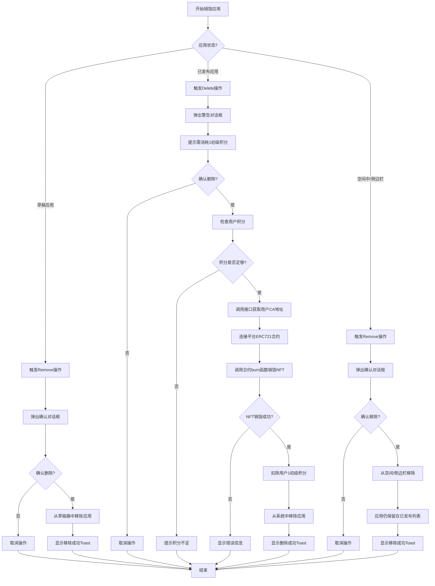

```mermaid

flowchart TD
    A[开始销毁应用] --> B{应用状态?}
    
    %% 草稿应用的移除流程
    B -->|草稿应用| C[触发Remove操作]
    C --> D[弹出确认对话框]
    D --> E{确认删除?}
    E -->|否| F[取消操作]
    F --> Z[结束]
    E -->|是| G[从草稿箱中移除应用]
    G --> H[显示移除成功Toast]
    H --> Z
    
    %% 已发布应用的删除流程
    B -->|已发布应用| I[触发Delete操作]
    I --> J[弹出警告对话框]
    J --> K[提示需消耗1初级积分]
    K --> L{确认删除?}
    L -->|否| M[取消操作]
    M --> Z
    L -->|是| N[检查用户积分]
    N --> O{积分是否足够?}
    O -->|否| P[提示积分不足]
    P --> Z
    O -->|是| Q[调用接口获取用户CA地址]
    Q --> R[连接平台ERC721合约]
    R --> S[调用合约burn函数销毁NFT]
    S --> T{NFT销毁成功?}
    T -->|否| U[显示错误信息]
    U --> Z
    T -->|是| V[扣除用户1初级积分]
    V --> W[从系统中移除应用]
    W --> X[显示删除成功Toast]
    X --> Z
    
    %% 空间或侧边栏中应用的移除
    B -->|空间中/侧边栏| Y[触发Remove操作]
    Y --> AA[弹出确认对话框]
    AA --> BB{确认移除?}
    BB -->|否| CC[取消操作]
    CC --> Z
    BB -->|是| DD[从空间/侧边栏移除]
    DD --> EE[应用仍保留在已发布列表]
    EE --> FF[显示移除成功Toast]
    FF --> Z

```