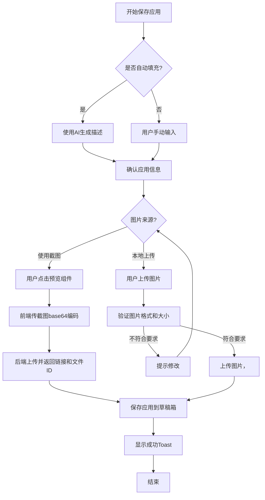

```mermaid
flowchart TD
    A[开始保存应用] --> B{是否自动填充?}
    B -->|是| C[使用AI生成描述]
    B -->|否| D[用户手动输入]
    C --> E[确认应用信息]
    D --> E
    E --> F{图片来源?}
    F -->|使用截图| G[用户点击预览组件]
    F -->|本地上传| H[用户上传图片]
    G --> G1[前端传截图base64编码]
    G1 --> G2[后端上传并返回链接和文件ID]
    H --> I[验证图片格式和大小]
    I -->|不符合要求| J[提示修改]
    J --> F
    I -->|符合要求| K1[上传图片，]
    G2 --> K[保存应用到草稿箱]
    K1 --> K
    K --> L[显示成功Toast]
    L --> M[结束]
```