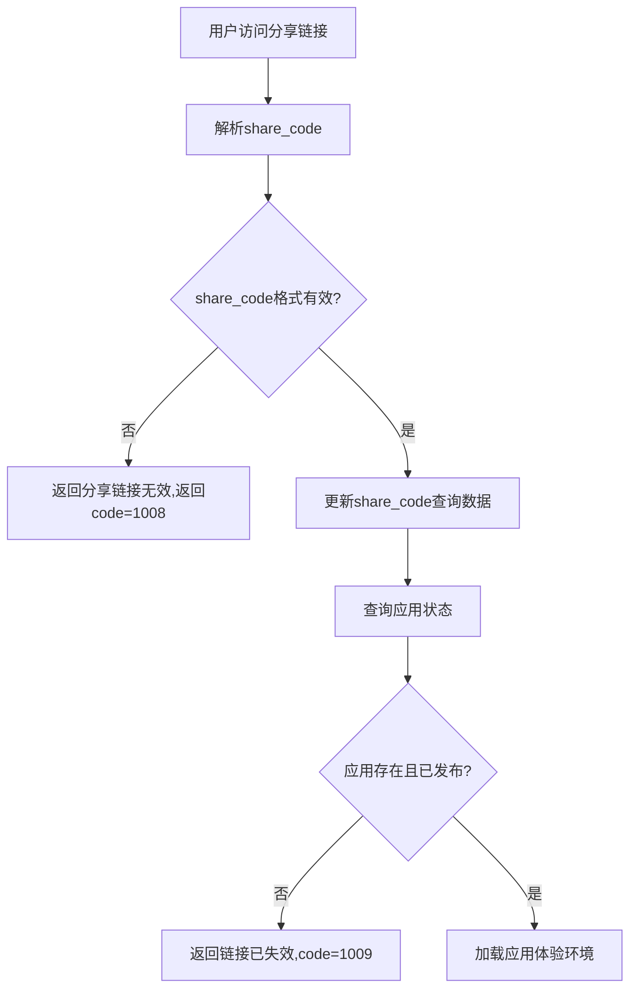

```mermaid

flowchart TD
    G[用户访问分享链接] --> H[解析share_code]
    H --> I{share_code格式有效?}
    I -->|否| J[返回分享链接无效,返回code=1008]
    I -->|是| K[更新share_code查询数据]
    K --> L[查询应用状态]
    L --> M{应用存在且已发布?}
    M -->|否| N[返回链接已失效,code=1009]
    M -->|是| O[加载应用体验环境]

```