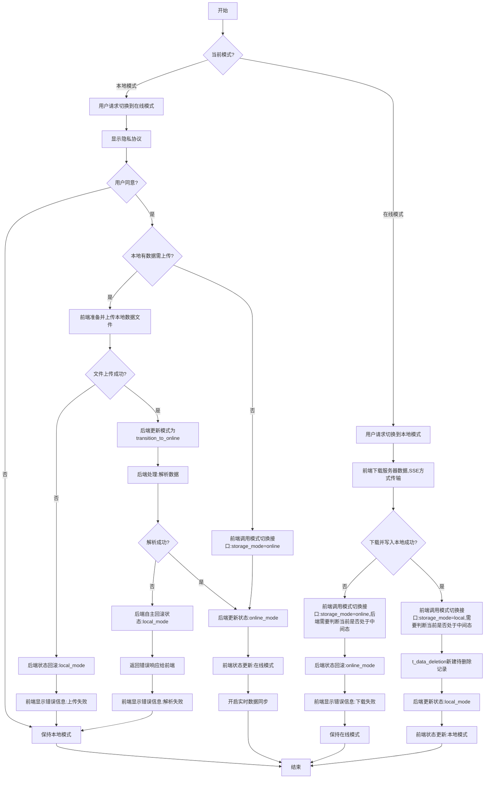

```mermaid

flowchart TD
    A[开始] --> B{当前模式?}
    
    %% 本地模式转在线模式
    B -->|本地模式| C[用户请求切换到在线模式]
    C --> D[显示隐私协议]
    D --> E{用户同意?}


    E -->|否| F[保持本地模式]
    F --> Z[结束]
    
    E -->|是| J{本地有数据需上传?}
    
    %% 有本地数据需上传的情况
    J -->|是| K[前端准备并上传本地数据文件]
    K --> L{文件上传成功?}
    
    %% 上传失败的情况
    L -->|否| N[后端状态回滚:local_mode]
    N --> O[前端显示错误信息:上传失败]
    O --> F
    
    %% 上传成功但解析失败的情况
    L -->|是| G[后端更新模式为transition_to_online]
    G --> P[后端处理:解析数据]
    P --> Q{解析成功?}
    Q -->|否| R[后端自主回滚状态:local_mode]
    R --> S[返回错误响应给前端]
    S --> T[前端显示错误信息:解析失败]
    T --> F
    
    %% 全部成功的情况
    Q -->|是| U[后端更新状态:online_mode]
    J -->|否| V[前端调用模式切换接口:storage_mode=online]
    V --> U
    
    U --> W[前端状态更新:在线模式]
    W --> X[开启实时数据同步]
    X --> Z
    
    %% 在线模式转本地模式
    B -->|在线模式| AA[用户请求切换到本地模式]
    AA --> AE[前端下载服务器数据,SSE方式传输]
    AE --> AF{下载并写入本地成功?}
    
    %% 下载失败的情况
    AF -->|否| AG[前端调用模式切换接口:storage_mode=online,后端需要判断当前是否处于中间态]
    AG --> AH[后端状态回滚:online_mode]
    AH --> AI[前端显示错误信息:下载失败]
    AI --> AJ[保持在线模式]
    AJ --> Z
    
    %% 下载成功的情况
    AF -->|是| AK[前端调用模式切换接口:storage_mode=local,需要判断当前是否处于中间态]
    AK --> AL[t_data_deletion新建待删除记录]
    AL --> AM[后端更新状态:local_mode]
    AM --> AN[前端状态更新:本地模式]
    AN --> Z

```