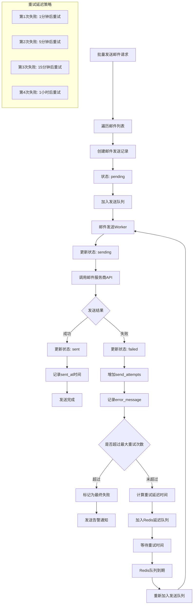

```mermaid
flowchart TD
    A[批量发送邮件请求] --> B[遍历邮件列表]
    B --> C[创建邮件发送记录]
    C --> D[状态: pending]
    D --> E[加入发送队列]
    
    E --> F[邮件发送Worker]
    F --> G[更新状态: sending]
    G --> H[调用邮件服务商API]
    H --> I{发送结果}
    
    I -->|成功| J[更新状态: sent]
    J --> K[记录sent_at时间]
    K --> L[发送完成]
    
    I -->|失败| M[更新状态: failed]
    M --> N[增加send_attempts]
    N --> O[记录error_message]
    O --> P{是否超过最大重试次数}
    
    P -->|超过| Q[标记为最终失败]
    Q --> R[发送告警通知]
    
    P -->|未超过| S[计算重试延迟时间]
    S --> T[加入Redis延迟队列]
    T --> U[等待重试时间]
    U --> V[Redis队列到期]
    V --> W[重新加入发送队列]
    W --> F
    
    subgraph "重试延迟策略"
        S1[第1次失败: 1分钟后重试]
        S2[第2次失败: 5分钟后重试]
        S3[第3次失败: 15分钟后重试]
        S4[第4次失败: 1小时后重试]
    end
```