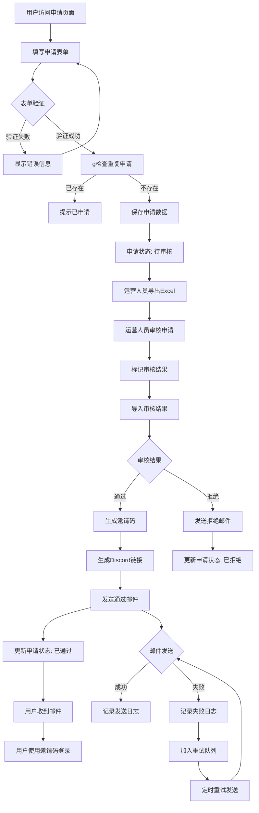

```mermaid
flowchart TD
    A[用户访问申请页面] --> B[填写申请表单]
    B --> C{表单验证}
    C -->|验证失败| D[显示错误信息]
    D --> B
    C -->|验证成功| E[g检查重复申请]
    E -->|已存在| F[提示已申请]
    E -->|不存在| G[保存申请数据]
    G --> H[申请状态: 待审核]
    
    H --> I[运营人员导出Excel]
    I --> J[运营人员审核申请]
    J --> K[标记审核结果]
    K --> L[导入审核结果]
    L --> M{审核结果}
    
    M -->|通过| N[生成邀请码]
    N --> O[生成Discord链接]
    O --> P[发送通过邮件]
    P --> Q[更新申请状态: 已通过]
    
    M -->|拒绝| R[发送拒绝邮件]
    R --> S[更新申请状态: 已拒绝]
    
    P --> T{邮件发送}
    T -->|成功| U[记录发送日志]
    T -->|失败| V[记录失败日志]
    V --> W[加入重试队列]
    W --> X[定时重试发送]
    X --> T
    
    Q --> Y[用户收到邮件]
    Y --> Z[用户使用邀请码登录]
```