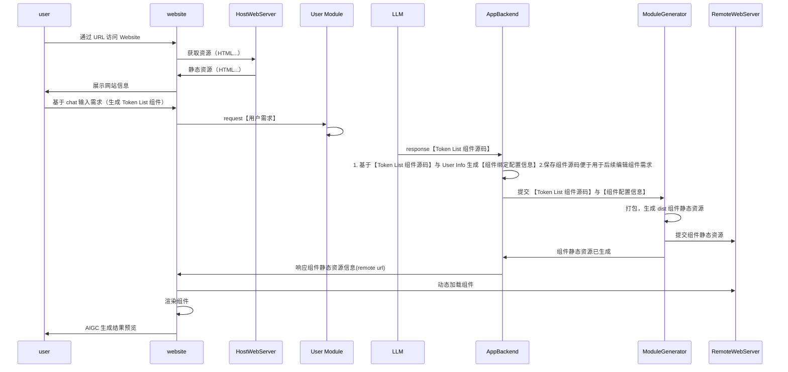

```mermaid
sequenceDiagram
    user ->> website: 通过 URL 访问 Website
	website ->> HostWebServer: 获取资源（HTML...）
	HostWebServer ->> website: 静态资源（HTML...）
	website ->> user: 展示网站信息
	user ->> website: 基于 chat 输入需求（生成 Token List 组件）
	website ->> User Module: request【用户需求】
	User Module ->> User Module: 
	LLM ->> AppBackend: response【Token List 组件源码】
	AppBackend ->> AppBackend: 1. 基于【Token List 组件源码】与 User Info 生成【组件绑定配置信息】2.保存组件源码便于用于后续编辑组件需求
	AppBackend ->> ModuleGenerator: 提交 【Token List 组件源码】与【组件配置信息】
	ModuleGenerator ->> ModuleGenerator: 打包，生成 dist 组件静态资源
	ModuleGenerator ->> RemoteWebServer: 提交组件静态资源
	ModuleGenerator ->> AppBackend: 组件静态资源已生成
	AppBackend ->> website: 响应组件静态资源信息(remote url)
	website ->> RemoteWebServer: 动态加载组件
	website ->> website: 渲染组件
	website ->> user: AIGC 生成结果预览
```