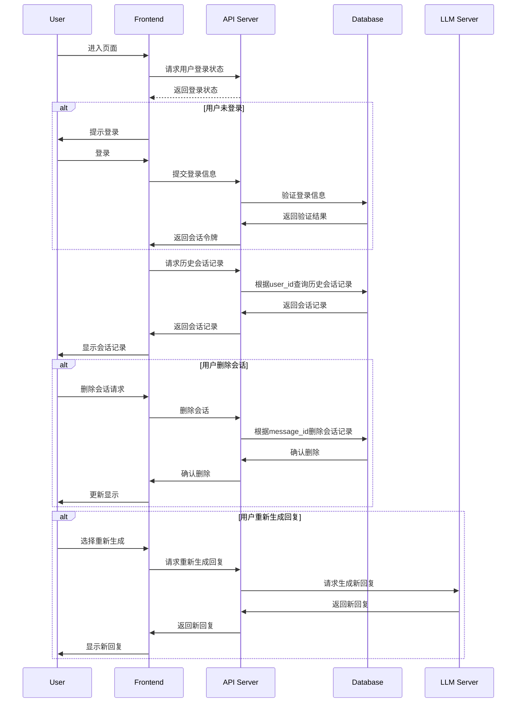

```mermaid
sequenceDiagram
    participant User
    participant Frontend
    participant API Server
    participant Database

    User->>Frontend: 进入页面
    Frontend->>API Server: 请求用户登录状态
    API Server-->>Frontend: 返回登录状态
    alt 用户未登录
        Frontend->>User: 提示登录
        User->>Frontend: 登录
        Frontend->>API Server: 提交登录信息
        API Server->>Database: 验证登录信息
        Database->>API Server: 返回验证结果
        API Server->>Frontend: 返回会话令牌
    end

    Frontend->>API Server: 请求历史会话记录
    API Server->>Database: 根据user_id查询历史会话记录
    Database->>API Server: 返回会话记录
    API Server->>Frontend: 返回会话记录
    Frontend->>User: 显示会话记录

    alt 用户删除会话
        User->>Frontend: 删除会话请求
        Frontend->>API Server: 删除会话
        API Server->>Database: 根据message_id删除会话记录
        Database->>API Server: 确认删除
        API Server->>Frontend: 确认删除
        Frontend->>User: 更新显示
    end

    alt 用户重新生成回复
        User->>Frontend: 选择重新生成
        Frontend->>API Server: 请求重新生成回复
        API Server->>LLM Server: 请求生成新回复
        LLM Server->>API Server: 返回新回复
        API Server->>Frontend: 返回新回复
        Frontend->>User: 显示新回复
    end


```