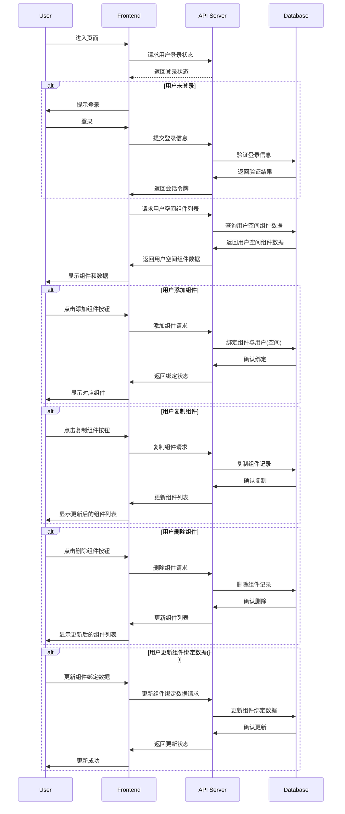

```mermaid
sequenceDiagram
    participant User
    participant Frontend
    participant API Server
    participant Database

    User->>Frontend: 进入页面
    Frontend->>API Server: 请求用户登录状态
    API Server-->>Frontend: 返回登录状态
    alt 用户未登录
        Frontend->>User: 提示登录
        User->>Frontend: 登录
        Frontend->>API Server: 提交登录信息
        API Server->>Database: 验证登录信息
        Database->>API Server: 返回验证结果
        API Server->>Frontend: 返回会话令牌
    end

    Frontend->>API Server: 请求用户空间组件列表
    API Server->>Database: 查询用户空间组件数据
    Database->>API Server: 返回用户空间组件数据
    API Server->>Frontend: 返回用户空间组件数据
    Frontend->>User: 显示组件和数据

    alt 用户添加组件
        User->>Frontend: 点击添加组件按钮
        Frontend->>API Server: 添加组件请求
        API Server->>Database: 绑定组件与用户(空间)
        Database->>API Server: 确认绑定
        API Server->>Frontend: 返回绑定状态
        Frontend->>User: 显示对应组件
    end

    alt 用户复制组件
        User->>Frontend: 点击复制组件按钮
        Frontend->>API Server: 复制组件请求
        API Server->>Database: 复制组件记录
        Database->>API Server: 确认复制
        API Server->>Frontend: 更新组件列表
        Frontend->>User: 显示更新后的组件列表
    end

    alt 用户删除组件
        User->>Frontend: 点击删除组件按钮
        Frontend->>API Server: 删除组件请求
        API Server->>Database: 删除组件记录
        Database->>API Server: 确认删除
        API Server->>Frontend: 更新组件列表
        Frontend->>User: 显示更新后的组件列表
    end

    alt 用户更新组件绑定数据(j)
        User->>Frontend: 更新组件绑定数据
        Frontend->>API Server: 更新组件绑定数据请求
        API Server->>Database: 更新组件绑定数据
        Database->>API Server: 确认更新
        API Server->>Frontend: 返回更新状态
        Frontend->>User: 更新成功
    end

```