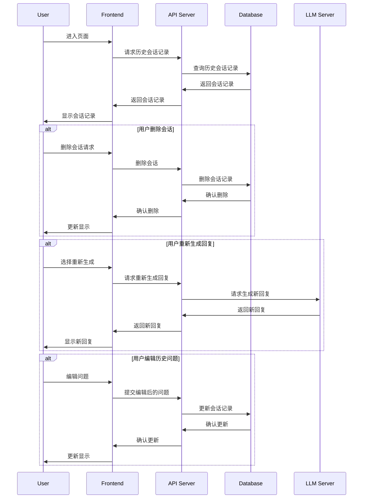

```mermaid
sequenceDiagram
    participant User
    participant Frontend
    participant API Server
    participant Database

    User->>Frontend: 进入页面
    Frontend->>API Server: 请求历史会话记录
    API Server->>Database: 查询历史会话记录
    Database->>API Server: 返回会话记录
    API Server->>Frontend: 返回会话记录
    Frontend->>User: 显示会话记录

    alt 用户删除会话
        User->>Frontend: 删除会话请求
        Frontend->>API Server: 删除会话
        API Server->>Database: 删除会话记录
        Database->>API Server: 确认删除
        API Server->>Frontend: 确认删除
        Frontend->>User: 更新显示
    end

    alt 用户重新生成回复
        User->>Frontend: 选择重新生成
        Frontend->>API Server: 请求重新生成回复
        API Server->>LLM Server: 请求生成新回复
        LLM Server->>API Server: 返回新回复
        API Server->>Frontend: 返回新回复
        Frontend->>User: 显示新回复
    end

    alt 用户编辑历史问题
        User->>Frontend: 编辑问题
        Frontend->>API Server: 提交编辑后的问题
        API Server->>Database: 更新会话记录
        Database->>API Server: 确认更新
        API Server->>Frontend: 确认更新
        Frontend->>User: 更新显示
    end

```