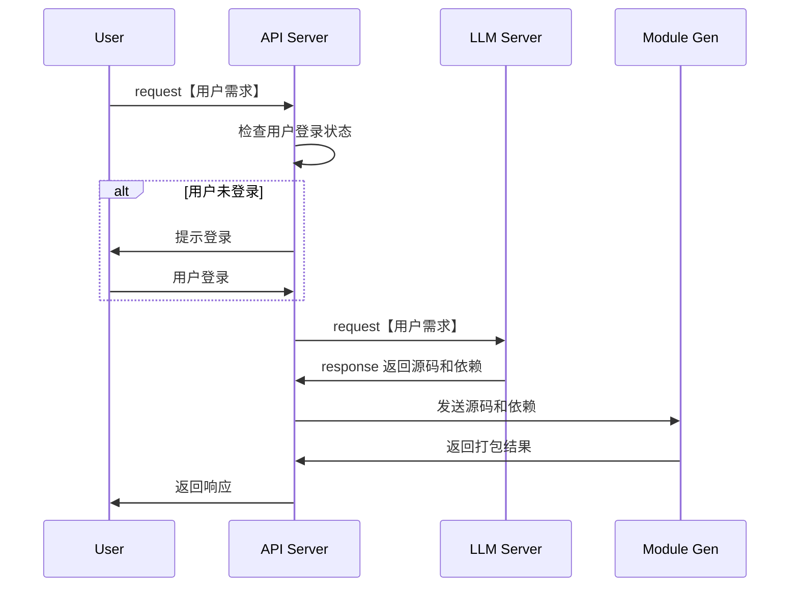

```mermaid
sequenceDiagram
    participant User
    participant API Server
    participant LLM Server
    participant Module Gen

    User->>API Server: request【用户需求】
    API Server->>API Server: 检查用户登录状态
    alt 用户未登录
        API Server->>User: 提示登录
        User->>API Server: 用户登录
    end

    API Server->>LLM Server: request【用户需求】
    LLM Server->>API Server: response 返回源码和依赖

    API Server->>Module Gen: 发送源码和依赖
    Module Gen->>API Server: 返回打包结果

    API Server->>User: 返回响应

```