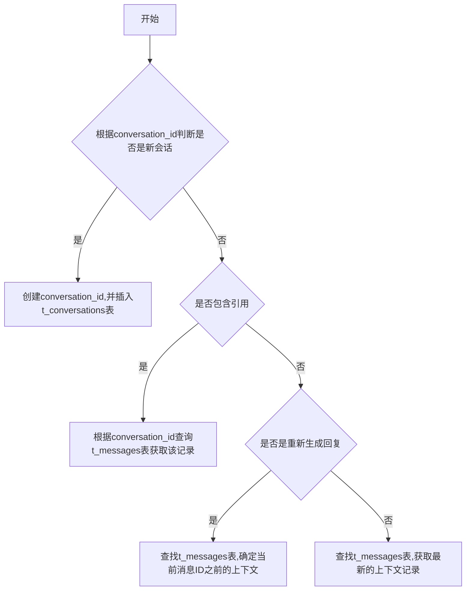

```mermaid
flowchart TD
    A[开始] --> B{根据conversation_id判断是否是新会话}
    B -- 是 --> C[创建conversation_id,并插入t_conversations表]
    B -- 否 --> D{是否包含引用}
    D -- 是 --> E[根据conversation_id查询t_messages表获取该记录]
    D -- 否 --> F{是否是重新生成回复}
    F -- 是 --> G[查找t_messages表,确定当前消息ID之前的上下文]
    F -- 否 --> H[查找t_messages表,获取最新的上下文记录]


```